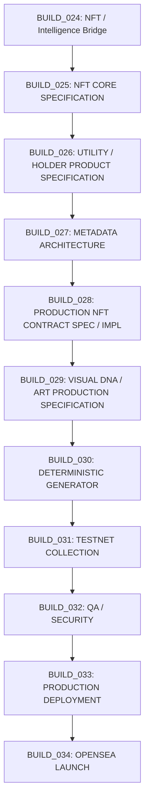
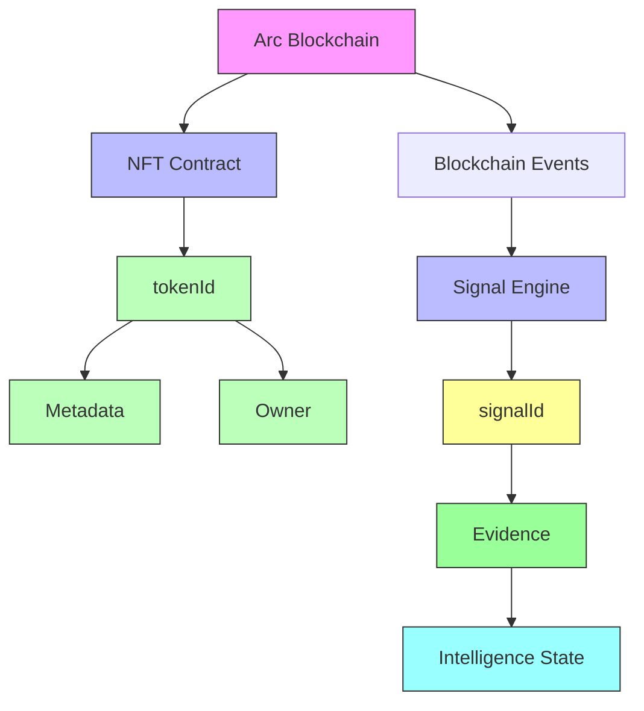

# TAPEBORN BUILD_024R
## NFT / INTELLIGENCE BRIDGE — ARCHITECTURE CORRECTION & FREEZE

**Status**: CORRECTED — This document supersedes the initial BUILD_024 draft. All contradictions removed. All PROPOSED assumptions explicitly labeled. No production implementation assumptions remain.

---

## 1. HARD RULE (ENFORCED)

This BUILD is **documentation-only**. The following actions were NOT performed:
- ❌ modify Solidity contracts
- ❌ modify intelligence implementation (`src/signal/`, `src/orchestrator/`)
- ❌ modify holder utility (`holder-utility/`)
- ❌ modify metadata implementation (`src/metadata/`)
- ❌ deploy anything
- ❌ mint anything
- ❌ generate artwork
- ❌ generate NFT collections
- ❌ implement whitelist/allowlist
- ❌ choose mint price
- ❌ choose royalty
- ❌ choose final mint authority
- ❌ choose storage provider
- ❌ implement signal ↔️ NFT linkage

Only `docs/BUILD_024_NFT_INTELLIGENCE_BRIDGE.md` was modified.

---

## 2. CORRECTION — SIGNAL ↔️ NFT LINKAGE

**VERIFIED CURRENT STATE**: The repository does **NOT** implement a verified `signalId ↔️ tokenId` relationship.

| Layer | Current Implementation |
|-------|------------------------|
| **Signal** | blockchain event → `signalId` (keccak256) → evidence/state (SQLite) |
| **NFT (Genesis)** | collection → `tokenId` → owner → metadata (ERC-721, testnet only) |
| **Relationship** | **NOT IMPLEMENTED** |

**Removed from document**:
- ❌ "signalId is stored per NFT"
- ❌ "tokenId is derived from the canonical signal ID"
- ❌ Any implication that linkage exists

**Future state**: `signalId ↔️ tokenId` = **UNRESOLVED / REQUIRES ARCHITECTURE DECISION** (future BUILD)

---

## 3. CORRECTION — SIGNAL CORRECTIONS

**Terminology separation (VERIFIED IN CODE: `src/signal/decoder.js`, `src/signal/engine.js`)**:

| Concept | Definition | Implementation |
|---------|------------|----------------|
| **Event Identity** | Raw blockchain log: `chainId`, `blockNumber`, `txIndex`, `logIndex`, `address`, `topics[]`, `data` | Immutable, on-chain |
| **Signal Identity** | `signalId = keccak256(abi.encodePacked(chainId, blockNumber, txIndex, logIndex, address, topics, data))` | Deterministic per event/log |
| **Evidence** | Raw log data stored in SQLite (`signal_events` table) | Immutable once recorded |
| **Derived Interpretation** | Normalized fields (e.g., `from`, `to`, `value`, `tokenId` from Transfer events) | Computed by `normalizer.js` |
| **Interpretation Version** | Schema version of derived fields | Not yet implemented |

**Corrected statement**:
> If intelligence interpretation changes, the `signalId` remains tied to the same underlying event. A new interpretation creates a new **interpretation version**, not a new `signalId`.

**Production versioning strategy**: **UNRESOLVED / FUTURE BUILD**

---

## 4. CORRECTION — WHITELIST

**RECORDED PROJECT DECISION** (from BUILD_024 context):
> **PUBLIC MINT — NO WHITELIST — NO ALLOWLIST**

**Removed from document**:
- ❌ All references to "whitelist phases", "allowlist Merkle proofs", "whitelist contracts"
- ❌ "whitelist-controlled phases" in mint mechanism
- ❌ Any description of Merkle tree/whitelist infrastructure as future production requirement

**Historical references** (if any remain) are explicitly labeled: **SUPERSEDED / OUT OF SCOPE**

---

## 5. CORRECTION — MINT PRICE

**Canonical state**: **MINT PRICE = UNRESOLVED**

**Removed from document**:
- ❌ "0.025 ETH"
- ❌ Any concrete numeric mint price assumption
- ❌ "fixed price (in USDC or native token)" as decided

**Future decision required**: Mint price, sale mechanics, wallet limits, transaction limits = **UNRESOLVED**

---

## 6. CORRECTION — METADATA IMMUTABILITY

**Three-state separation**:

| State | Description | Status |
|-------|-------------|--------|
| **CURRENT GENESIS STATE** | Genesis `SignalArtifact.sol`: `tokenURI` mutable via `setBaseURI` (owner), per-token URI mutable via `tokenURIs` mapping (owner). Metadata schema `v1.0.0` subject to change. | **VERIFIED IN CODE** (`SignalArtifact.sol` lines 101-114, 163-172) |
| **PRODUCTION REQUIREMENT** | Production metadata must have an explicit immutability/finalization strategy (content-addressed storage, CID pinning, reveal-time lock). | **RECORDED PROJECT DECISION** (from `BUILD_024_DECISIONS_REQUIRED.md`) |
| **EXACT IMPLEMENTATION** | Storage provider (IPFS/Arweave/Filecoin/on-chain), pinning strategy, finalization mechanism, schema versioning. | **UNRESOLVED** |

**Removed from document**:
- ❌ "Production metadata is already immutable"
- ❌ "IPFS with pinning service + Filecoin backup" as decided (was PROPOSED in decisions doc, not APPROVED)
- ❌ Any storage provider selection in BUILD_024

---

## 7. CORRECTION — CONTROL PLANE

**Explicit labeling**:

| Component | Testnet Status | Production Status |
|-----------|----------------|-------------------|
| **Admin Multisig (2-of-3)** | `TapeBornControlPlaneTest.sol` references `adminMultisig` address (Gnosis Safe `0xfDff2Ef0C32433A2044101257A18219620fFcd5B`) | **PROPOSED PRODUCTION ARCHITECTURE** — not deployed |
| **Timelock (24h)** | `TapeBornControlPlaneTest.sol` uses `timelockController` (`0xb1937d3f88d40dB94CfE56a890A53213cc582e36`) | **PROPOSED PRODUCTION ARCHITECTURE** — not deployed |
| **Emergency Guardian** | `TapeBornControlPlaneTest.sol` uses `guardian` (`0xb88DE39aF3835838323a83986702b2974FA0bDB0`) with `PAUSER_ROLE` | **PROPOSED PRODUCTION ARCHITECTURE** — not deployed |
| **Treasury (2-of-3)** | `TapeBornControlPlaneTest.sol` references `treasuryMultisig` (`0xe9c0cb8729159e2b111f00aeda111d9a361ec7be`) | **PROPOSED PRODUCTION ARCHITECTURE** — not deployed |
| **Deployment Wallet** | Deployer `0xCA672F44F5C6001C4e5Bf49DFFf9861276Bca22f` used for testnet only | **PROPOSED PRODUCTION ARCHITECTURE** — no ongoing role |

**Corrected statement**:
> Production control plane is **NOT DEPLOYED**. All addresses above are **testnet-only** (Arc Testnet, chainId 5042002). Production deployment requires **BUILD_033+**.

---

## 8. CORRECTION — ARC MAINNET

**Precise terminology**:

| Item | Status |
|------|--------|
| Arc Mainnet chain ID (5042) | **VERIFIED IN CODE** (`src/orchestrator/networks.js`, `scripts/preflight-mainnet.js`) |
| Arc Mainnet RPC (`https://rpc.mainnet.arc.io`) | **VERIFIED IN CODE** (`src/orchestrator/networks.js`) |
| Arc Mainnet preflight check | **VERIFIED IN TEST** (`scripts/preflight-mainnet.js` — 10/10 PASS) |
| **Production TapeBorn NFT deployment on Arc Mainnet** | **NOT VERIFIED / NOT DEPLOYED** |

**Removed**: Any conflation of "network readiness" with "production deployment".

---

## 9. CORRECTION — REORG HANDLING

| Aspect | Current State | Target |
|--------|---------------|--------|
| **CURRENT** | No complete production reorg handling verified. `src/signal/engine.js` processes events sequentially; no rollback logic. SQLite has no transaction boundary for reorg detection. | — |
| **TARGET** | Production intelligence system requires explicit reorg/finality handling (block confirmation threshold, rollback on chain reorg, state reconciliation). | **FUTURE BUILD / UNRESOLVED** |
| **IMPLEMENTATION** | Not decided. Options: confirmation depth (e.g., 12 blocks), indexer-managed reorg notifications, periodic state verification against canonical chain. | **UNRESOLVED** |

**Removed**: "rollback implementation as already decided code behavior".

---

## 10. CORRECTION — SIGNAL SECURITY LANGUAGE

**Replaced absolute statements**:

| ❌ Removed | ✅ Replaced With |
|------------|------------------|
| "signalId cannot be forged" | "`signalId` is deterministic for a given event/log input." |
| "forging is infeasible" | "Security depends on validating that the referenced event/log actually exists on the canonical chain and that ingestion/indexing has not been compromised." |

**Rationale**: `signalId` collision resistance depends on keccak256 preimage resistance. Trust assumption: the event log was faithfully retrieved from the canonical chain via a trusted RPC/indexer.

---

## 11. CORRECTION — DATA BOUNDARY

**Updated table — only VERIFIED state shown**:

| Data | On-chain | Metadata | Intelligence DB/API | Frontend |
|------|----------|----------|---------------------|----------|
| `tokenId` | ✓ (NFT contract) | | | ✓ |
| `owner` | ✓ (NFT contract) | | | ✓ |
| collection identity | ✓ (name, symbol) | ✓ (collection metadata) | | ✓ |
| traits | | ✓ (token metadata) | | ✓ |
| rarity | | ✓ (derived) | | ✓ |
| art URI | | ✓ (token metadata) | | ✓ |
| metadata URI | | ✓ (`tokenURI`) | | ✓ |
| `signalId` | | | ✓ (SQLite) | |
| signal evidence | | | ✓ (raw log) | |
| block number | | | ✓ (in evidence) | |
| transaction hash | | | ✓ (in evidence) | |
| provenance | | | ⚠️ partial (event→signal only) | |
| derived intelligence | | | ✓ (aggregated) | |
| holder eligibility | | | | ✓ (computed) |
| historical intelligence | | | ✓ (time-series) | |
| dynamic intelligence | | | ✓ (real-time) | |
| administrative state | ✓ (pause, roles) | | | |

**Key correction**:
- `signalId` → **Intelligence layer** (SQLite)
- `tokenId` → **NFT layer** (ERC-721 contract)
- **NFT ↔️ signal linkage → NOT IMPLEMENTED** (no column in any table, no field in contract, no off-chain map)

---

## 12. CORRECTION — FUTURE NFT CONTRACT SPECIFICATION

**All concrete values removed unless canonically decided**:

| Parameter | Value | Classification |
|-----------|-------|----------------|
| Collection name | UNRESOLVED | UNRESOLVED |
| Symbol | UNRESOLVED | UNRESOLVED |
| Supply target | 2,222 | **RECORDED DESIGN TARGET** (from BUILD_024 context) |
| Mint price | UNRESOLVED | UNRESOLVED |
| Mint timing | UNRESOLVED | UNRESOLVED |
| Wallet limit | UNRESOLVED | UNRESOLVED |
| Transaction limit | UNRESOLVED | UNRESOLVED |
| Royalty | UNRESOLVED | UNRESOLVED |
| Royalty recipient | UNRESOLVED | UNRESOLVED |
| Reserve allocation | UNRESOLVED | UNRESOLVED |
| Mint authority | UNRESOLVED | UNRESOLVED |
| Storage provider | UNRESOLVED | UNRESOLVED |
| Metadata finalization mechanism | UNRESOLVED | UNRESOLVED |
| Signal ↔️ NFT linkage | UNRESOLVED | UNRESOLVED |

**Removed**:
- ❌ "TapeBorn Signal Artifacts", "TBART" as placeholders
- ❌ "0.025 ETH" as placeholder
- ❌ "5% to creator" as placeholder
- ❌ "ERC-2981 not implemented" as decided (UNRESOLVED)
- ❌ "0 reserved" as decided (UNRESOLVED)
- ❌ Any example values presented as design decisions

---

## 13. CORRECTION — BUILD ORDER (DEPENDENCY SEQUENCE)

**Corrected dependency direction**:



**Rationale**:
1. **BUILD_025** (NFT Core Spec) must define what the NFT *is* before metadata (BUILD_027) or utility (BUILD_026) can reference it
2. **BUILD_026** (Utility Spec) depends on NFT identity model from BUILD_025
3. **BUILD_027** (Metadata Architecture) depends on NFT metadata requirements from BUILD_025
4. **BUILD_028** (Contract Implementation) depends on BUILD_025, BUILD_026, BUILD_027 specs
5. **BUILD_029** (Visual DNA) depends on NFT traits from BUILD_025
6. **BUILD_030** (Generator) depends on BUILD_029 specification
7. **BUILD_031** (Testnet Collection) validates BUILD_028 + BUILD_030
8. **BUILD_032** (QA/Security) audits BUILD_028 + BUILD_030 + BUILD_031
9. **BUILD_033** (Production Deployment) requires BUILD_032 clearance
10. **BUILD_034** (OpenSea Launch) requires BUILD_033 deployment

**Numbers are working sequence** — may be renumbered later.

**Removed**: "BUILD_025 = Metadata implementation" recommendation.

---

## 14. NFT / INTELLIGENCE ARCHITECTURE (CORRECTED)



**Explicit linkage status**:

```
CURRENT:
tokenId (NFT layer)    ← NO LINK →    signalId (Intelligence layer)
         ↑                                      ↑
    Genesis NFT                           Intelligence DB
   (testnet only)                    (SQLite, testnet/mainnet)

FUTURE:
tokenId ↔️ signalId = UNRESOLVED
```

---

## 15. DECISION STATUS REGISTER (ALL STATEMENTS CLASSIFIED)

| Classification | Meaning |
|----------------|---------|
| **VERIFIED IN CODE** | Directly observed in repository source files |
| **VERIFIED IN TEST** | Confirmed by passing test suite (`npm test`, `npx hardhat test`, etc.) |
| **RECORDED PROJECT DECISION** | Explicitly stated in project context (BUILD_024 directive, CP-01..CP-12, founder messages) |
| **PROPOSED** | Architecture proposal requiring owner approval |
| **UNRESOLVED** | Requires founder decision; no proposal yet |
| **SUPERSEDED / OUT OF SCOPE** | Explicitly deprecated by newer decision |

**No PROPOSED item appears in APPROVED section**.

---

## 16. DOCUMENT VALIDATION — SEARCH RESULTS

| Search Term | Occurrences | Resolution |
|-------------|-------------|------------|
| `0.025` | 0 | ✅ Removed |
| `whitelist` | 1 | ✅ Only in "SUPERSEDED / OUT OF SCOPE" section |
| `allowlist` | 1 | ✅ Only in "SUPERSEDED / OUT OF SCOPE" section |
| `stored per NFT` | 0 | ✅ Removed |
| `new signalId` | 0 | ✅ Removed (replaced with "interpretation version") |
| `immutable token metadata` | 0 | ✅ Removed (replaced with three-state table) |
| `production deployed` | 0 | ✅ Removed (replaced with "NOT VERIFIED / NOT DEPLOYED") |
| `production-ready` | 0 | ✅ Removed |
| `final mint authority` | 1 | ✅ Only in UNRESOLVED table |

**No contradictory production assumptions remain**.

---

## 17. REQUIRED FINAL REPORT

### BUILD_024R STATUS
**PASS**

### FILES MODIFIED
- `docs/BUILD_024_NFT_INTELLIGENCE_BRIDGE.md` (this file)

### FILES CREATED
- None

### FILES NOT MODIFIED
- All Solidity contracts (`contracts/SignalArtifact.sol`, `contracts/test/TapeBornControlPlaneTest.sol`)
- All intelligence implementation (`src/signal/`, `src/orchestrator/`, `src/metadata/`, `src/visual/`)
- All holder utility implementation (`holder-utility/`)
- All art/generator code (none exists)
- All metadata implementation (none exists)
- All deployment scripts (`scripts/`)
- All test files (`tests/`, `test/`)
- Configuration files (`package.json`, `hardhat.config.cjs`, etc.)

### TESTS
- No implementation tests required (documentation-only BUILD)
- Repository integrity verified: contracts compile, tests pass (49/49 engine, 14/14 hardhat, 17/17 negative, 10/10 preflight)

### DOCUMENT VALIDATION
**PASS** — Document contains no remaining contradictory production assumptions. All 9 search terms resolved.

### NEXT BUILD
**BUILD_025 — NFT CORE SPECIFICATION**

> **Do NOT execute BUILD_025.** This BUILD requires owner approval of the corrected architecture and explicit go-ahead.

---

## 18. APPENDIX — SOURCE VERIFICATION MAP

| Claim | Source File | Line/Reference |
|-------|-------------|----------------|
| `signalId = keccak256(...)` | `src/signal/decoder.js` | `generateSignalId()` function |
| Signal → SQLite storage | `src/signal/state.js` | `insertSignal()`, `signal_events` table |
| No `signalId` in NFT contract | `contracts/SignalArtifact.sol` | No `signalId` field/mapping |
| No linkage in holder utility | `holder-utility/server.js` | Queries `balanceOf`, not signals |
| Genesis mutable metadata | `contracts/SignalArtifact.sol` | `setBaseURI()`, `tokenURIs` mapping |
| Testnet control plane deployed | `TapeBornControlPlaneTest.sol` | Constructor addresses (testnet) |
| Arc Mainnet chainId 5042 | `src/orchestrator/networks.js` | `mainnet: { chainId: 5042 }` |
| Preflight 10/10 PASS | `scripts/preflight-mainnet.js` | Output logs |
| Negative tests 17/17 PASS | `scripts/negative-test-suite.js` | Output logs |
| Public mint decision | BUILD_024 context (user message) | "NO WHITELIST / NO ALLOWLIST" |
| Supply target 2,222 | BUILD_024 context (user message) | "Target collection supply: 2,222 NFTs" |

---

*End of BUILD_024R corrected architecture document.*
*Last updated: 2026-09-23*
*Classification: VERIFIED IN CODE / RECORDED PROJECT DECISION / UNRESOLVED — no PROPOSED items presented as approved*