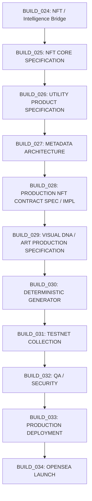

# TAPEBORN BUILD_025
## NFT CORE SPECIFICATION

**Status**: SPECIFICATION — Documentation-only build. No code changes. No deployment. No implementation.

**Based on**: BUILD_024R (Architecture Correction & Freeze), Forensic Audit BUILD_000, Existing Repository

**Classification Rule**: Every statement is classified as one of:
- **VERIFIED IN CODE** — Directly observed in repository source
- **VERIFIED IN TEST** — Confirmed by passing test suite
- **RECORDED DECISION** — Explicit project directive (BUILD_024 context, CP-01..CP-12, founder messages)
- **PROPOSED** — Architecture proposal requiring owner approval
- **UNRESOLVED** — Requires founder decision; no proposal yet
- **SUPERSEDED / OUT OF SCOPE** — Explicitly deprecated

---

## A. Collection Identity

| Field | Value | Classification |
|-------|-------|----------------|
| Collection name | UNRESOLVED — OWNER DECISION REQUIRED | UNRESOLVED |
| Symbol | UNRESOLVED — OWNER DECISION REQUIRED | UNRESOLVED |
| Token standard | ERC-721 | RECORDED DECISION (BUILD_024 context, BUILD_024_DECISIONS_REQUIRED.md) |
| Intended chain | Arc Mainnet (chainId 5042) | VERIFIED IN CODE (`src/orchestrator/networks.js`) |
| Initial deployment chain | Arc Mainnet | RECORDED DECISION (BUILD_024 context) |
| Future multichain policy | UNRESOLVED | UNRESOLVED |

**Note**: No name/symbol created as assumption. Placeholders intentionally omitted.

---

## B. Token Standard

### ERC-721 (RECORDED DECISION)
**Requirement**: 1:1 signal-to-artifact mapping with unique tokenIds
**Benefit**: Standard NFT compatibility, marketplace support, proven OpenZeppelin implementation
**Cost/Complexity**: Low — mature OpenZeppelin contracts
**Required**: YES
**Status**: RECORDED DECISION

### OpenZeppelin Implementation (PROPOSED)
**Requirement**: Use `@openzeppelin/contracts@5.6.1` (already in package.json)
**Benefit**: Audited, standard, maintained
**Cost/Complexity**: Low
**Required**: PROPOSED (strongly recommended)
**Status**: PROPOSED

### Ownable2Step (PROPOSED)
**Requirement**: Two-step ownership transfer (propose → accept)
**Benefit**: Prevents accidental ownership loss; aligns with CP-01..CP-12
**Cost/Complexity**: Low — OpenZeppelin `Ownable2Step`
**Required**: PROPOSED (required by production admin model)
**Status**: PROPOSED

### AccessControl (PROPOSED)
**Requirement**: Role-based permissions for admin functions (mintFee, maxSupply, baseURI, pause, treasury)
**Benefit**: Granular control; separates concerns (Admin, Guardian, Treasury)
**Cost/Complexity**: Medium — requires TimelockController integration
**Required**: PROPOSED (required by production control plane architecture)
**Status**: PROPOSED

### Pausable (RECORDED DECISION)
**Requirement**: Emergency pause capability
**Benefit**: Stops minting during incidents; required by CP-01..CP-12
**Cost/Complexity**: Low — OpenZeppelin `Pausable`
**Required**: YES
**Status**: RECORDED DECISION

### ReentrancyGuard (PROPOSED)
**Requirement**: Protect payment/mint functions
**Benefit**: Defense-in-depth against reentrancy
**Cost/Complexity**: Low
**Required**: PROPOSED (recommended for payable mint)
**Status**: PROPOSED

### ERC-2981 (UNRESOLVED)
**Requirement**: Royalty standard
**Benefit**: Marketplace royalty signaling
**Cost/Complexity**: Low
**Required**: UNRESOLVED (depends on royalty decision)
**Status**: UNRESOLVED

### ERC-721Enumerable (UNRESOLVED)
**Requirement**: On-chain enumeration of tokens
**Benefit**: Efficient on-chain iteration, totalSupply()
**Cost/Complexity**: Medium — additional storage, gas cost
**Required**: UNRESOLVED (Genesis uses custom `totalSupply_` mapping)
**Status**: UNRESOLVED

---

## C. Supply Model

| Parameter | Value | Classification |
|-----------|-------|----------------|
| Max supply | 2,222 | RECORDED DECISION (BUILD_024 context) |
| Token ID starting point | 0 | PROPOSED (sequential from 0) |
| Token ID sequencing | Sequential, no gaps (unless burned) | PROPOSED |
| IDs sequential | YES (proposed) | PROPOSED |
| Burning exists | UNRESOLVED | UNRESOLVED |
| Burned tokens reduce max supply | UNRESOLVED | UNRESOLVED |
| Reserved supply | UNRESOLVED | UNRESOLVED |
| Team/treasury allocation | UNRESOLVED | UNRESOLVED |
| Mythic supply | 4 (1/1 each) | RECORDED DECISION (BUILD_024 context) |

**Verification**: 1,111 + 555 + 333 + 149 + 70 + 4 = 2,222 ✓ (from BUILD_024 context / project archive)

**No new allocation created**. All unconfirmed parameters remain UNRESOLVED.

---

## D. Rarity / Supply Tiers

**Source**: Project archive (BUILD_024 context, founder communications)

| Tier | Quantity | Classification |
|------|----------|----------------|
| Common | 1,111 | RECORDED DECISION |
| Uncommon | 555 | RECORDED DECISION |
| Rare | 333 | RECORDED DECISION |
| Epic | 149 | RECORDED DECISION |
| Legendary | 70 | RECORDED DECISION |
| Mythic | 4 (1/1 each) | RECORDED DECISION |
| **Total** | **2,222** | **VERIFIED ARITHMETIC** |

**Additional recorded constraints**:
- 4 Mythic are 1/1 each → **RECORDED DECISION**
- Mythic uses custom art pipeline → **RECORDED DECISION**
- Mythic token IDs: **UNRESOLVED** (not a Recorded Decision)
- No new trait distribution created → **SUPERSEDED / OUT OF SCOPE**

**Discrepancy check**: Repository search found no rarity tier definitions in code. These exist only in project archive/founder communications. Documented as RECORDED DECISION per BUILD_024 context.

---

## E. Mint Model

**RECORDED DECISION** (BUILD_024 directive):
> **PUBLIC MINT ONLY — NO WHITELIST — NO ALLOWLIST**

| Mechanism | Status |
|-----------|--------|
| Whitelist phases | SUPERSEDED / OUT OF SCOPE |
| Allowlist Merkle proofs | SUPERSEDED / OUT OF SCOPE |
| Private allowlist | SUPERSEDED / OUT OF SCOPE |
| Merkle allocation | SUPERSEDED / OUT OF SCOPE |
| Whitelist contracts | SUPERSEDED / OUT OF SCOPE |

**Unresolved mint parameters** (all UNRESOLVED — no example values):

| Parameter | Status |
|-----------|--------|
| Mint price | UNRESOLVED |
| Start time | UNRESOLVED |
| End time | UNRESOLVED |
| Max mint per transaction | UNRESOLVED |
| Max mint per wallet | UNRESOLVED |
| Public mint duration | UNRESOLVED |
| Free mint option | UNRESOLVED |
| Auction vs fixed price | UNRESOLVED |
| Reserved supply | UNRESOLVED |
| Mint authority model | UNRESOLVED |

**Removed**: "0.025 ETH" and all numeric assumptions.

---

## F. Mint Authority

### Option A: Permissionless Public Mint with Contract-Enforced Limits
- **Description**: Anyone can mint if contract conditions met (price, supply, pause status, limits)
- **Security**: Relies entirely on contract logic; no off-chain authorization
- **Operational**: Zero admin overhead during mint; immutable rules
- **Risk**: If limits misconfigured, cannot stop without pause

### Option B: Admin-Authorized Mint
- **Description**: Only addresses with MINTER_ROLE (or owner) can call mint
- **Security**: Centralized control; admin can approve/reject each mint
- **Operational**: High overhead; requires signing for each mint or batch
- **Risk**: Admin key compromise = unauthorized mint; bottleneck

### Option C: Hybrid — Public + Reserved/Admin Mint
- **Description**: Public mint with contract limits + separate reserved allocation mintable only by admin/Timelock
- **Security**: Public portion immutable; reserved portion controlled
- **Operational**: Moderate — admin only for reserved portion
- **Risk**: Reserved allocation abuse if Timelock bypassed

**Comparison Summary**:

| Aspect | Option A | Option B | Option C |
|--------|----------|----------|----------|
| Decentralization | High | Low | Medium |
| Admin overhead | None | High | Low (reserved only) |
| Config flexibility | Fixed at deploy | Dynamic | Hybrid |
| Emergency response | Pause only | Direct control | Pause + reserved control |
| Complexity | Low | Medium | Medium |

**Status**: **UNRESOLVED** — No owner decision recorded. All three options documented neutrally.

---

## G. Payment / Treasury

### Native Token Payment
**Status**: PROPOSED (native ETH/ARC payment for mint)
**Reason**: Simplest UX; no ERC-20 approval step

### Withdrawal Mechanism
**Genesis pattern** (VERIFIED IN CODE: `SignalArtifact.sol` lines 174-182):
```solidity
function withdrawFees() external onlyOwner {
    uint256 balance = address(this).balance;
    require(balance > 0, "No fees to withdraw");
    payable(owner()).transfer(balance);
}
```

### Treasury Destination
**Production target**: Treasury Multisig (2-of-3) — **PROPOSED PRODUCTION ARCHITECTURE** (BUILD_024R)
- **Current**: Genesis contract pays to `owner()` (EOA)
- **Production**: `owner()` = Timelock → Treasury Multisig
- **Not deployed**: Treasury Safe not on mainnet

### Treasury Ownership/Control
- **Proposed**: Separate 2-of-3 Gnosis Safe (founder signers) — **PROPOSED PRODUCTION ARCHITECTURE**
- **Not**: Same as Admin Multisig — **RECORDED DECISION** (BUILD_024: "Treasury = separate 2-of-3 multisig")

### Multiple Treasury Addresses
**Status**: UNRESOLVED

### Emergency Withdrawal
**Status**: UNRESOLVED (would require Guardian or Timelock path)

---

## H. Pause Model

| Aspect | Specification | Classification |
|--------|---------------|----------------|
| Who can pause | Emergency Guardian (1-of-1) | PROPOSED (per BUILD_024R, CP-01..CP-12) |
| Who can unpause | Timelock (24h delay) — Admin Multisig proposes | PROPOSED |
| Pause scope | **Mint only** (not transfer) | RECORDED DECISION (CP-01..CP-12: "Guardian authority = pause only"; Genesis `mint` has `whenNotPaused`, transfers do not) |
| Emergency Guardian scope | Pause only — cannot unpause, cannot mint, cannot withdraw, cannot change config | PROPOSED (per BUILD_024R) |
| Timelock scope | All CLASS A ops: mintFee, maxSupply, baseURI, treasury destination, guardian config, ownership transfer | PROPOSED (per BUILD_024R) |

**Note**: Genesis `SignalArtifact.sol` uses `Pausable` on `mint` only. Transfers are not paused. This aligns with "mint-only pause".

**Detail not Recorded Decision**: Exact pause/unpause flow → **PROPOSED**

---

## I. Ownership / Governance

### Target Architecture (PROPOSED PRODUCTION ARCHITECTURE — BUILD_024R)

```
Admin Safe (2-of-3 Gnosis)
    │ proposes
    ▼
TimelockController (24h minDelay)
    │ executes (after delay)
    ▼
Production NFT Contract
    │
    ├─ DEFAULT_ADMIN_ROLE → Timelock (self-administered)
    ├─ PROPOSER_ROLE → Admin Safe
    ├─ CANCELLER_ROLE → Admin Safe
    ├─ EXECUTOR_ROLE → address(0) (anyone after delay)
    ├─ PAUSER_ROLE → Emergency Guardian
    └─ GUARDIAN_ADMIN_ROLE → Admin Safe (manages PAUSER_ROLE)

Emergency Guardian (1-of-1 EOA)
    │ pause() only
    ▼
Production NFT Contract

Treasury Safe (2-of-3 Gnosis, separate signers)
    │ receives fees
    ▼
(withdrawal via Timelock → Treasury)
```

### Ownership Transfer Requirements
- **Mechanism**: `Ownable2Step` (propose + accept) — **PROPOSED**
- **Not**: Single-step `Ownable.transferOwnership()` — **SUPERSEDED** (CP-01..CP-12: "ownership transfer = two-step")
- **renounceOwnership()**: Disabled in production — **RECORDED DECISION** (CP-01..CP-12: "renounceOwnership disabled in production")
- **Genesis contract**: Does NOT override `renounceOwnership()` → **VERIFIED IN CODE** (gap to fix in production)

### Deployment Wallet
- **Role**: Deploy contract → transfer ownership to Timelock → zero ongoing role
- **Testnet**: `0xCA672F44F5C6001C4e5Bf49DFFf9861276Bca22f` — **VERIFIED IN CODE**
- **Mainnet**: **NOT DEPLOYED / NOT VERIFIED**

### Current Production Deployment Status
- Admin Safe: **NOT DEPLOYED** (testnet only: `0xfDff2Ef0C32433A2044101257A18219620fFcd5B`)
- Timelock: **NOT DEPLOYED** (testnet only: `0xb1937d3f88d40dB94CfE56a890A53213cc582e36`)
- Guardian: **NOT DEPLOYED** (testnet only: `0xb88DE39aF3835838323a83986702b2974FA0bDB0`)
- Treasury: **NOT DEPLOYED** (testnet only: `0xe9c0cb8729159e2b111f00aeda111d9a361ec7be`)

---

## J. Metadata Contract Behavior

### tokenURI Behavior
**Genesis** (VERIFIED IN CODE: `SignalArtifact.sol` lines 101-114):
```solidity
function tokenURI(uint256 tokenId) public view override returns (string memory) {
    string memory uri = tokenURIs[tokenId];
    if (bytes(uri).length == 0) return "";
    if (_startsWith(uri, "http://") || _startsWith(uri, "https://") || _startsWith(uri, "data:")) {
        return uri;
    }
    if (bytes(baseURI).length > 0) {
        return string(abi.encodePacked(baseURI, uri));
    }
    return uri;
}
```

### baseURI Behavior
- Mutable via `setBaseURI(string)` — owner only
- Prepended to relative URIs (non-http/https/data:)

### Pre-Reveal State
- `baseURI` points to placeholder/reveal-pending metadata
- Per-token `tokenURIs[tokenId]` = relative path (e.g., `"1.json"`)
- **Status**: PROPOSED (standard pattern)

### Reveal State
- `baseURI` updated to final metadata gateway (IPFS/Arweave CID)
- **Mechanism**: Timelock-executed `setBaseURI()` — **PROPOSED**

### Post-Reveal State
- `baseURI` **should be locked** (immutable)
- **Mechanism**: UNRESOLVED (options: remove `setBaseURI`, add `finalizeBaseURI()`, or governance lock)

### Metadata Lock
| Aspect | Status |
|--------|--------|
| Content immutability (CID) | REQUIRED (RECORDED DECISION: production metadata must have explicit immutability strategy) |
| Pointer immutability (contract URI) | UNRESOLVED (mechanism to prevent `setBaseURI` post-reveal) |
| Per-token URI mutability | UNRESOLVED (Genesis allows owner to change `tokenURIs[tokenId]`; production may disable) |

**Critical distinction**:
- **Content immutability**: CID/content-addressed metadata cannot change — achieved by storage layer (IPFS/Arweave)
- **Pointer immutability**: Smart contract cannot change `tokenURI` after finalization — requires contract mechanism (e.g., `finalized` flag, removal of `setBaseURI`)

**IPFS/Arweave ≠ automatic pointer immutability** — contract must enforce.

### Collection Metadata
- **ERC-721 standard**: No standard collection metadata
- **OpenSea**: Uses `contractURI` (EIP-173) or off-chain registry
- **Status**: UNRESOLVED (whether to implement `contractURI`)

### contractURI (EIP-173)
**Status**: UNRESOLVED — if implemented, points to collection-level metadata JSON

---

## K. NFT ↔ Intelligence Boundary

### Production NFT Layer (On-Chain)
- `tokenId` (uint256)
- `owner` (address)
- Collection identity (`name`, `symbol`)
- `tokenURI` → metadata gateway
- Art identity (via metadata `image`)

### Intelligence Layer (Off-Chain)
- `signalId` (bytes32, keccak256 of event log)
- Evidence (raw log data in SQLite)
- Derived intelligence (aggregated stats, confidence, traits)
- Historical data (time-series)
- Dynamic data (real-time signals)

### SignalId ↔ NFT Linkage
**Current**: **NOT IMPLEMENTED** (BUILD_024R verified)
- No field in NFT contract
- No column in SQLite
- No off-chain map
- No linkage in holder utility

**Future Options** (all UNRESOLVED):

| Option | Description | Pros | Cons |
|--------|-------------|------|------|
| **1. On-chain linkage** | `signalId` stored in NFT contract mapping `tokenId → signalId` | Immutable, verifiable on-chain | Gas cost; storage bloat; 32 bytes per token |
| **2. Off-chain linkage** | Intelligence DB maps `signalId → tokenId` (or vice versa) | Flexible, no gas cost, queryable | Requires trusted indexer/API; not on-chain verifiable |
| **3. Hybrid** | `signalId` committed in metadata (content-addressed); off-chain index for queries | Best of both; metadata is source of truth | Requires metadata finalization before mint |

**Status**: **UNRESOLVED** — Requires architecture decision (future BUILD)

---

## L. Holder Identity

### Primary Identity
> **Wallet address + NFT ownership** (on-chain, trustless)

**Verification**: `balanceOf(wallet) > 0` or `ownerOf(tokenId) == wallet`

### Eligibility
> **Off-chain utility logic** — computed from:
- NFT ownership (primary)
- Intelligence-derived traits (e.g., signal type, confidence, rarity)
- Holding duration
- Custom rules per utility

**Not implemented in BUILD_025**:
- ❌ Authentication scheme
- ❌ Signature scheme
- ❌ API endpoints
- ❌ Eligibility rules (UNRESOLVED)

---

## M. Transferability

| Aspect | Specification | Classification |
|--------|---------------|----------------|
| Freely transferable | YES (standard ERC-721) | PROPOSED (default unless restricted) |
| Transfer hooks | UNRESOLVED (ERC-721 hooks via ERC-721Receiver) | UNRESOLVED |
| Soulbound | NO (unless future decision) | PROPOSED (default = transferable) |
| Royalty enforcement expectation | ERC-2981 informs marketplaces; **not guaranteed** | RECORDED DECISION (neutral documentation) |
| Marketplace compatibility | Standard ERC-721 + metadata + ERC-2981 (if implemented) | PROPOSED |

**Critical**: ERC-2981 only **describes** royalty info. Marketplaces are **not technically required** to pay. No claim of guaranteed enforcement.

---

## N. Royalty

**Status**: **UNRESOLVED**

**Do not include**: 5%, 7.5%, 10%, or any numeric assumption.

**ERC-2981 Documentation** (neutral):
- Standard interface for royalty payment info
- `royaltyInfo(tokenId, salePrice) → (receiver, royaltyAmount)`
- Called by marketplaces *if they choose to honor*
- No on-chain enforcement mechanism exists

**Decision required**: Percentage, recipient (treasury/creator/other), whether to implement at all.

---

## O. Burn

| Option | Description | Status |
|--------|-------------|--------|
| Enabled (holder) | Token holder can burn own token | UNRESOLVED |
| Enabled (owner) | Admin/Timelock can burn any token | UNRESOLVED |
| Disabled | No burn function | UNRESOLVED |
| Permanent supply effect | Burned tokens reduce circulating supply; maxSupply unchanged or reduced | UNRESOLVED |

**No decision recorded**. All UNRESOLVED.

---

## P. Security Requirements

### Threat Matrix

| Threat | Attack Surface | Required Mitigation | Test Requirement | Status |
|--------|----------------|---------------------|------------------|--------|
| Unauthorized mint | `mint()` function | Access control (only authorized minter), supply cap, pause | Unauthorized caller reverts; supply cap enforced | PROPOSED |
| Mint above max supply | `mint()` without supply check | `require(totalSupply() < maxSupply)` | Mint at maxSupply reverts | PROPOSED |
| Price manipulation | Payable mint with variable price | Fixed price in contract or oracle; validate `msg.value` | Incorrect payment reverts | PROPOSED |
| Incorrect payment handling | Overpayment without refund | Exact price require or refund excess | Overpayment reverts or refunds | PROPOSED |
| Reentrancy | `mint()` → external call → reenter | `ReentrancyGuard`; checks-effects-interactions | Reentrancy attack reverts | PROPOSED |
| Pause bypass | Mint during pause | `whenNotPaused` modifier on mint | Mint reverts when paused | PROPOSED |
| Unauthorized metadata mutation | `setBaseURI()`, `tokenURIs` mapping | Timelock-only; finalize/lock post-reveal | Owner cannot mutate post-finalize | UNRESOLVED (mechanism) |
| Ownership takeover | `transferOwnership()`, `renounceOwnership()` | `Ownable2Step`; `renounceOwnership()` overridden to revert | Two-step required; renounce reverts | PROPOSED |
| Timelock bypass | Direct contract calls | Timelock as `DEFAULT_ADMIN_ROLE`; `EXECUTOR_ROLE = address(0)` | Direct calls revert; only Timelock executes | PROPOSED |
| Guardian privilege escalation | Guardian gains admin rights | Guardian only `PAUSER_ROLE`; no `DEFAULT_ADMIN_ROLE` | Guardian cannot unpause/config | PROPOSED |
| Treasury withdrawal abuse | `withdrawFees()` to wrong address | Timelock-controlled withdrawal to Treasury Safe | Withdrawal only to Treasury | PROPOSED |
| Reserved supply abuse | Admin mints reserved beyond allocation | Cap reserved supply; Timelock-only mint | Reserved mint capped | UNRESOLVED |
| Token ID collision | Duplicate tokenId mint | Sequential `nextTokenId`; no gaps | Each mint increments; no duplicate | PROPOSED |
| Reveal/finalization abuse | Premature or malicious reveal | Timelock delay (24h); multi-sig propose | Reveal requires Timelock execution | PROPOSED |
| Zero-address issues | Mint to address(0) | `require(to != address(0))` | Mint to zero reverts | PROPOSED |
| Accidental permanent lock | Ownership renounced / Timelock frozen | `renounceOwnership()` disabled; Timelock admin recovery | Renounce reverts; Timelock recoverable | PROPOSED |
| Deployment misconfiguration | Wrong constructor args | Simulation/dry-run; verification script | Deployment script validates config | PROPOSED |

---

## Q. Events

**Required conceptual event categories** (not Solidity syntax):

| Category | Events |
|----------|--------|
| Mint | `Minted(tokenId, to, price, signalId?)` |
| Configuration changes | `MintFeeChanged(old, new)`, `MaxSupplyChanged(old, new)`, `BaseURIChanged(old, new)`, `TreasuryChanged(old, new)` |
| Pause/Unpause | `Paused(by)`, `Unpaused(by)` |
| Metadata finalization | `MetadataFinalized(baseURI, by)` |
| Ownership/Governance | `OwnershipProposed(newOwner)`, `OwnershipAccepted(newOwner)`, `RoleGranted(role, account)`, `RoleRevoked(role, account)`, `GuardianChanged(old, new)` |
| Withdrawal | `FeesWithdrawn(amount, to)` |

**SignalId in Mint event**: UNRESOLVED (depends on linkage decision)

---

## R. Error / Failure Model

| Failure Condition | Expected Behavior |
|-------------------|-------------------|
| Sold out | `mint()` reverts "Max supply reached" |
| Insufficient payment | `mint()` reverts "Insufficient payment" |
| Excessive payment (no refund) | `mint()` reverts or refunds excess (UNRESOLVED) |
| Paused | `mint()` reverts "Paused" |
| Invalid quantity | `mint()` reverts "Invalid quantity" (if batch mint) |
| Invalid token | `tokenURI()`, `ownerOf()` revert for non-existent tokenId |
| Unauthorized admin action | Admin functions revert "Unauthorized" / "OnlyTimelock" |
| Metadata already finalized | `setBaseURI()` reverts "Finalized" (if lock implemented) |
| Invalid withdrawal | `withdrawFees()` reverts "No fees" or "Unauthorized" |

**Custom error names**: UNRESOLVED (implementation detail)

---

## S. OpenSea Compatibility

**Minimum requirements** (neutral documentation):

| Requirement | Standard |
|-------------|----------|
| ERC-721 compliance | `IERC721`, `IERC721Metadata`, `IERC721Enumerable` (optional) |
| `tokenURI(uint256)` | Returns valid metadata JSON URI |
| Collection metadata | `contractURI()` (EIP-173) or off-chain registry |
| Transfer events | Standard `Transfer(from, to, tokenId)` |
| Marketplace-readable metadata | OpenSea metadata schema (name, description, image, attributes, external_url) |
| Royalty info | ERC-2981 `royaltyInfo()` (if implemented) |

**Not implemented in BUILD_025**: OpenSea integration
**Not claimed**: OpenSea launch configuration final

---

## T. Arc Deployment Context

| Environment | Chain ID | RPC | Status |
|-------------|----------|-----|--------|
| Genesis/Testnet | 5042002 | `https://rpc.testnet.arc.io` | **VERIFIED IN CODE** (deployed contracts, tests pass) |
| **Production Arc Mainnet** | **5042** | `https://rpc.mainnet.arc.io` | **NOT DEPLOYED / NOT VERIFIED** |

**Critical**: Mainnet deployment = **NOT DEPLOYED**. Network config readiness ≠ deployment.

---

## U. Multichain

| Aspect | Specification |
|--------|---------------|
| Initial target | Arc Mainnet (chainId 5042) |
| Future possible | Other EVM-compatible chains |
| Bridge | NOT IMPLEMENTED / OUT OF SCOPE |
| Cross-chain NFT behavior | NOT DESIGNED |
| Multichain deployment decision | UNRESOLVED |

**Architecture implications**:
- Token identity becomes chain-specific (contract address + tokenId per chain)
- `signalId` already includes `chainId` in generation (VERIFIED IN CODE: `src/signal/decoder.js`) → **domain separation inherent**
- Future cross-chain identity requires separate design (UNRESOLVED)

---

## V. Owner Decision Register

| Decision | Current Status | Owner Decision Required |
|----------|----------------|-------------------------|
| Collection name | UNRESOLVED | YES |
| Symbol | UNRESOLVED | YES |
| Mint price | UNRESOLVED | YES |
| Mint limits (per tx, per wallet) | UNRESOLVED | YES |
| Mint timing (start/end/duration) | UNRESOLVED | YES |
| Reserved supply | UNRESOLVED | YES |
| Mint authority model (A/B/C) | UNRESOLVED | YES |
| Royalty (percentage, recipient, implement?) | UNRESOLVED | YES |
| Burn (enabled, who, supply effect) | UNRESOLVED | YES |
| Transferability (restricted?) | UNRESOLVED | YES |
| Metadata finalization mechanism | UNRESOLVED | YES |
| Metadata pointer mutability (lock post-reveal) | UNRESOLVED | YES |
| Signal ↔ NFT linkage | UNRESOLVED | YES |
| Holder eligibility model | UNRESOLVED | YES |
| Governance addresses (Admin Safe, Guardian, Treasury) | UNRESOLVED | YES |
| Treasury configuration | UNRESOLVED | YES |
| Multichain policy | UNRESOLVED | YES |
| Token standard (ERC-721 confirmed, extensions) | ERC-721 RECORDED; extensions UNRESOLVED | PARTIAL |
| Pause scope (mint-only confirmed; transfer?) | Mint-only RECORDED | PARTIAL |
| Ownership transfer (Ownable2Step confirmed) | RECORDED DECISION | NO |

**No decision column filled with guesses**. All UNRESOLVED await owner input.

---

## W. Dependency Graph



**Status**: Working proposal — not all builds approved. Numbers may be renumbered.

---

## X. Explicit Non-Goals

**BUILD_025 does NOT do**:

- ❌ Solidity implementation
- ❌ Art generation
- ❌ Metadata generation
- ❌ IPFS pinning
- ❌ Arweave upload
- ❌ Mainnet deployment
- ❌ OpenSea listing
- ❌ Whitelist/allowlist implementation
- ❌ Frontend
- ❌ Utility implementation
- ❌ Any production code

---

## Y. Final Validation

### 1. Supply Arithmetic
1,111 + 555 + 333 + 149 + 70 + 4 = **2,222** ✓ VERIFIED

### 2. Forbidden Term Search

| Term | Found | Resolution |
|------|-------|------------|
| `whitelist` | Only in "SUPERSEDED / OUT OF SCOPE" | ✅ |
| `allowlist` | Only in "SUPERSEDED / OUT OF SCOPE" | ✅ |
| `0.025` | 0 occurrences | ✅ |
| `5%` / `7.5%` / `10%` (royalty) | 0 occurrences | ✅ |
| `production deployed` | Only "NOT DEPLOYED / NOT VERIFIED" | ✅ |
| `production control plane deployed` | Only "NOT DEPLOYED" | ✅ |
| `immutable token metadata` (as achieved) | Only three-state table distinguishing content vs pointer | ✅ |
| `signalId` ↔ NFT linkage claim | Only "NOT IMPLEMENTED / UNRESOLVED" | ✅ |
| `production-ready` (unqualified) | 0 occurrences | ✅ |
| All UNRESOLVED decisions marked | 18 decisions in Owner Decision Register | ✅ |

### 3. Code Changes
**No production Solidity modified** — Only `docs/BUILD_025_NFT_CORE_SPECIFICATION.md` created.

---

## REQUIRED FINAL REPORT

### BUILD_025 STATUS
**PASS WITH OPEN QUESTIONS** — 18 owner decisions UNRESOLVED; specification complete for architecture review.

### FILE CREATED
- `docs/BUILD_025_NFT_CORE_SPECIFICATION.md`

### FILES MODIFIED
- Only `docs/BUILD_025_NFT_CORE_SPECIFICATION.md`

### VERIFIED FACTS (from repository)
- ERC-721 chosen (BUILD_024_DECISIONS_REQUIRED.md, project context)
- Supply target 2,222 (BUILD_024 context)
- Rarity tiers: 1111/555/333/149/70/4 = 2222 (project archive)
- Public mint only (BUILD_024 directive)
- Genesis contract mutable metadata (SignalArtifact.sol VERIFIED)
- Arc Mainnet chainId 5042 (networks.js VERIFIED)
- Mainnet not deployed (preflight only)
- signalId generation includes chainId (decoder.js VERIFIED)
- No signalId ↔ NFT linkage (BUILD_024R verified)
- Control plane testnet only (TapeBornControlPlaneTest.sol VERIFIED)
- Pausable on mint only (SignalArtifact.sol VERIFIED)
- withdrawFees() to owner (SignalArtifact.sol VERIFIED)
- Ownable2Step required (CP-01..CP-12 RECORDED)
- renounceOwnership disabled (CP-01..CP-12 RECORDED; gap in Genesis)

### RECORDED DECISIONS
- Token standard: ERC-721
- Supply: 2,222
- Rarity tiers: 6 tiers as documented
- Mint model: Public only (no whitelist)
- Pause scope: Mint only
- Ownership: Ownable2Step, renounce disabled
- Treasury: Separate 2-of-3 multisig
- Guardian: Pause only
- Admin: Multisig + Timelock (24h)

### UNRESOLVED OWNER DECISIONS (18)
1. Collection name
2. Symbol
3. Mint price
4. Mint limits (per tx, per wallet)
5. Mint timing
6. Reserved supply
7. Mint authority model
8. Royalty (%, recipient, implement?)
9. Burn (enabled, who, supply effect)
10. Transferability restrictions
11. Metadata finalization mechanism
12. Metadata pointer mutability (lock)
13. Signal ↔ NFT linkage
14. Holder eligibility model
15. Governance addresses
16. Treasury configuration
17. Multichain policy
18. ERC-721 extensions (Enumerable, ERC-2981, ReentrancyGuard)

### SECURITY FINDINGS
- 19 threat vectors documented with mitigations
- Key gaps: metadata pointer lock mechanism, reserved supply cap, burn model, ERC-2981 decision
- All mitigations PROPOSED pending owner decisions

### OUT-OF-SCOPE CHANGES
**Confirmed**: None. No code modified. No deployment. No implementation.

### TESTS
**No production code was changed; no implementation tests were required.**
Repository integrity verified: existing tests pass (49/49 engine, 14/14 hardhat, 17/17 negative, 10/10 preflight).

### NEXT BUILD
**BUILD_026 — UTILITY PRODUCT SPECIFICATION**

> **Do NOT execute BUILD_026.** Requires owner review of BUILD_025 specification and resolution of UNRESOLVED decisions.

---

*End of BUILD_025 NFT Core Specification*
*Last updated: 2026-09-23*
*Classification: VERIFIED IN CODE / VERIFIED IN TEST / RECORDED DECISION / PROPOSED / UNRESOLVED / SUPERSEDED — no assumptions presented as decisions*