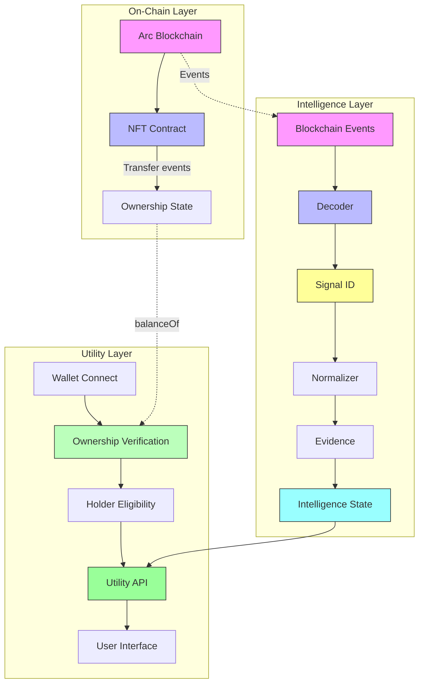
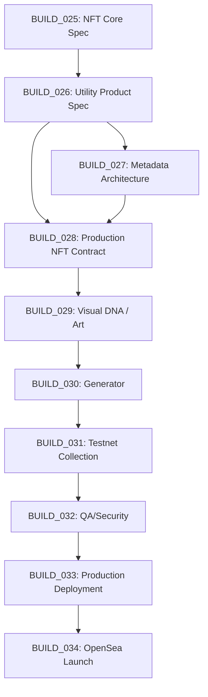

# TAPEBORN BUILD_026
## UTILITY PRODUCT SPECIFICATION

**Status**: SPECIFICATION — Documentation-only build. No code changes. No implementation. No deployment.

**Based on**: BUILD_024R (Architecture Correction), BUILD_025 (NFT Core Specification), BUILD_000 (Forensic Audit), Existing Repository

**Classification Rule**: Every statement classified as:
- **VERIFIED IN CODE** — Directly observed in repository
- **VERIFIED IN TEST** — Confirmed by passing test suite
- **RECORDED DECISION** — Explicit project directive
- **PROPOSED** — Architecture proposal requiring owner approval
- **UNRESOLVED** — Requires founder decision; no proposal yet
- **SUPERSEDED / OUT OF SCOPE** — Explicitly deprecated

---

## A. PRODUCT DEFINITION

### TapeBorn Intelligence — Product Layers

| Layer | Description | Current Status | Classification |
|-------|-------------|----------------|----------------|
| **Public Intelligence** | Signal feed accessible without NFT ownership; limited to recent signals, basic signal detail, evidence view | Partially implemented (holder-utility proxies to :3456) | PROPOSED (not production) |
| **Holder Intelligence** | Full signal feed, historical intelligence, advanced filters/search, provenance depth, experimental features | Partially implemented (holder dashboard, signal-feed endpoints) | PROPOSED (not production) |
| **Future/Experimental Intelligence** | Predictive analytics, cross-chain correlation, ML-derived patterns, custom alerting | Not implemented | UNRESOLVED |

**Core Principle**: Intelligence remains a data/product layer; NFT functions as access credential/identity layer. Dynamic intelligence is NOT embedded in NFT metadata. Holder eligibility derives from on-chain ownership.

---

## B. USER TYPES

| Type | Definition | Classification |
|------|------------|----------------|
| **Visitor** | No wallet connected; browses public landing page | RECORDED DECISION (BUILD_025) |
| **Connected Wallet** | Wallet connected (signature verified); ownership not confirmed | PROPOSED |
| **Holder** | Wallet verified + `balanceOf(wallet) > 0` on production NFT contract | RECORDED DECISION (BUILD_025) |
| **Multi-Holder** | Holder with `balanceOf(wallet) > 1` | RECORDED DECISION (BUILD_025: no extra benefit unless Recorded Decision) |

**No benefit escalation based on NFT count** — UNRESOLVED unless owner decides.

---

## C. PUBLIC VS HOLDER ACCESS MATRIX

| Feature | Visitor | Connected Wallet | Holder | Classification |
|---------|---------|------------------|--------|----------------|
| Signal feed (recent) | ✓ (limited) | ✓ | ✓ | PROPOSED |
| Signal detail | ✓ | ✓ | ✓ | PROPOSED |
| Evidence view | ✓ | ✓ | ✓ | PROPOSED |
| Historical intelligence | ✗ | ✗ | ✓ | PROPOSED |
| Provenance depth | Limited | Limited | ✓ | PROPOSED |
| Advanced filters | ✗ | ✗ | ✓ | PROPOSED |
| Advanced search | ✗ | ✗ | ✓ | PROPOSED |
| Holder dashboard | ✗ | ✗ | ✓ | PROPOSED |
| Collection data | ✓ | ✓ | ✓ | PROPOSED |
| Experimental intelligence | ✗ | ✗ | ✓ | PROPOSED |
| Future premium features | ✗ | ✗ | UNRESOLVED | UNRESOLVED |

**Note**: Not all intelligence is automatically holder-only. Boundary is PROPOSED, not decided.

---

## D. HOLDER IDENTITY FLOW

**Conceptual Flow** (from BUILD_025, enhanced):

```
1. Wallet Connects
       │
       ▼
2. Signature Verification (nonce-based)
       │
       ▼
3. Ownership Verification
       ├─► balanceOf(address) on NFT contract
       ├─► Chain ID verification (Arc Mainnet = 5042)
       └─► Contract address verification
       │
       ▼
4. Eligibility Evaluation
       ├─► Holder? (balance > 0)
       ├─► Tier? (based on traits, count — UNRESOLVED)
       └─► Custom rules? (UNRESOLVED)
       │
       ▼
5. Utility Access Granted
       ├─► Session token / cache (5 min TTL in current impl)
       └─► Scope: public / holder / experimental
       │
       ▼
6. Ownership Changes / Session Invalidation
       ├─► Transfer event → invalidate cache
       ├─► Manual refresh
       └─► TTL expiry
```

**Authentication**: Current implementation uses nonce + ECDSA signature (`holder-utility/server.js` lines 70-114) — **VERIFIED IN CODE** but **NOT PRODUCTION** (tested only on testnet).

**Signature standard**: UNRESOLVED / FUTURE IMPLEMENTATION DECISION (EIP-191 personal_sign current; EIP-712, SIWE, other options open).

---

## E. OWNERSHIP SOURCE OF TRUTH

| Source | Role | Authority |
|--------|------|-----------|
| **NFT Contract State (on-chain)** | `balanceOf(address)`, `ownerOf(tokenId)`, `Transfer` events | **AUTHORITATIVE** |
| Blockchain RPC / Indexer | Read path for ownership | Trusted read (not write) |
| Intelligence DB / Cache | Cached ownership state, holder session | Derived / cached only — NOT authoritative |
| Frontend | Display layer | No authority |

**Critical**: Database/indexer is a cache. If cache disagrees with chain, chain wins. Current implementation queries contract directly via ethers.js (`holder-utility/server.js` line 136) — **VERIFIED IN CODE**.

---

## F. SIGNAL PRODUCT — Conceptual Fields

**Supported by current intelligence architecture** (VERIFIED IN CODE: `src/signal/engine.js`, `src/signal/state.js`):

| Field | Source | Example |
|-------|--------|---------|
| `signalId` | `keccak256` of canonical payload | `0xabc...` |
| `chain` | Event chainId | `5042` (Arc Mainnet) |
| `block` | Block number | `12345678` |
| `transaction` | Transaction hash | `0xdef...` |
| `contract/address` | Event emitter address | `0xUSDC...` |
| `event` | Signal type | `large_transfer` |
| `timestamp` | Block timestamp | `2026-09-23T12:00:00Z` |
| `decoded data` | Normalized fields (`from`, `to`, `valueUsdc`, etc.) | Varies by type |
| `evidence` | Raw log + receipt | Stored in SQLite |
| `provenance` | Decoder + version | `v1.0.0` |
| `confidence` | Deterministic per type | `0.8`, `0.9` |
| `quality` | `complete` / `partial` | Added BUILD_018 |

**Not yet supported** (PROPOSED if added):
- `prediction` / `alpha score` — UNRESOLVED
- `cross-chain correlation` — UNRESOLVED
- `alert rule match` — UNRESOLVED

---

## G. SIGNAL DETAIL EXPERIENCE

### Conceptual Flow
```
Signal Feed (list)
       │
       ▼
Signal Detail (single)
       │
       ├──► Raw Evidence
       │     ├─ Transaction hash
       │     ├─ Block number
       │     ├─ Log index
       │     ├─ Raw topics + data
       │     └─ Receipt status
       │
       ├──► Decoded Interpretation
       │     ├─ Signal type
       │     ├─ Normalized fields (from, to, value, etc.)
       │     ├─ Signal version
       │     └─ Confidence + quality
       │
       └──► Derived Intelligence
             ├─ Aggregated stats (chain avg, wallet history)
             ├─ Contextual enrichment (labels, tags)
             └─ Experimental projections (UNRESOLVED)
```

### Separation Enforced
| Category | Description | Mutability |
|----------|-------------|------------|
| **Raw Evidence** | Direct from blockchain log/receipt | Immutable |
| **Decoded Interpretation** | Deterministic decoder output (versioned) | Immutable per version |
| **Derived Intelligence** | Computed, aggregated, heuristic | Mutable (improves over time) |

**Never conflate derived intelligence with raw blockchain fact** — RECORDED DECISION (BUILD_024).

---

## H. SIGNAL CORRECTIONS / INTERPRETATION VERSIONING

**BUILD_024 Correction Model** (VERIFIED IN DOCUMENTATION):

| Concept | Behavior |
|---------|----------|
| **Event Identity** | Immutable — raw blockchain log |
| **Signal Identity** | Immutable — `signalId` tied to event |
| **Interpretation Version** | Mutable — new schema version creates new interpretation |
| **Correction** | Creates new interpretation version; original `signalId` unchanged |

**Current implementation**: `SIGNAL_VERSIONS` per type in `engine.js` (lines 45-53) — **VERIFIED IN CODE**. No correction/versioning API yet.

**Future requirement**: Versioned interpretation API, correction audit trail — UNRESOLVED.

---

## I. NFT ↔ SIGNAL RELATIONSHIP

### Current Status
**NOT IMPLEMENTED** (BUILD_024R verified — no linkage in contract, DB, or utility)

### Three Models

| Model | Description | Utility Value | Complexity | Provenance | Scalability | Multichain |
|-------|-------------|---------------|------------|------------|-------------|------------|
| **A: No Direct Relationship** | NFT = access token only; intelligence independent | Low — no signal-specific utility | Low | NFT provenance only | High (independent) | Simple |
| **B: Off-Chain Linkage** | Intelligence DB maps `signalId ↔ tokenId`; metadata references signal | Medium — signal-specific traits, provenance in metadata | Medium (indexer, metadata gen) | Metadata references signal | Medium (DB sync) | Chain-specific DB |
| **C: On-Chain + Off-Chain Linkage** | NFT contract stores `signalId` per `tokenId`; metadata + DB both reference | High — verifiable on-chain, rich metadata | High (gas, storage) | Full on-chain + off-chain | Lower (32 bytes/token) | Chain-specific contract |

**Final selection**: **UNRESOLVED** — requires architecture decision (future BUILD).

---

## J. HOLDER VALUE LEVELS

| Level | Name | Description | Classification |
|-------|------|-------------|----------------|
| **1 — Access** | Basic access | Holder can access holder-only intelligence areas (signal feed, detail) | PROPOSED |
| **2 — Depth** | Detailed data | Holder sees full evidence, provenance, confidence breakdown | PROPOSED |
| **3 — History** | Historical intelligence | Holder accesses time-series, historical signals, trend data | PROPOSED |
| **4 — Advanced Tools** | Filtering/search | Holder uses advanced filters, custom queries, saved searches | PROPOSED |
| **5 — Experimental** | Experimental features | Holder gets early access to predictive, ML, cross-chain features | UNRESOLVED |

**No promises of**:
- ❌ Financial returns
- ❌ Token rewards
- ❌ Guaranteed alpha
- ❌ Investment performance
- ❌ Profit sharing

Unless **RECORDED DECISION** exists (none currently).

---

## K. HOLDER DASHBOARD — Conceptual

**Conceptual components** (not implemented):

| Component | Description |
|-----------|-------------|
| Connected wallet | Address, chain, signature status |
| Owned NFTs | Token IDs, metadata preview, rarity |
| Collection identity | Name, symbol, total supply, contract address |
| Holder status | Verified / unverified, tier (if applicable) |
| Available utility | Enabled features based on status |
| Recent signals | Latest signals relevant to holder |
| Historical access | Time-range signal history |
| Provenance access | Deep-dive into signal evidence |

**Not frontend implementation** — specification only.

---

## L. API PRODUCT BOUNDARY

### Existing (VERIFIED IN CODE: `holder-utility/server.js`)

| Endpoint | Method | Auth | Scope | Status |
|----------|--------|------|-------|--------|
| `/api/health` | GET | None | Public | **VERIFIED IN CODE** |
| `/api/whitelist/check` | POST | Signature | Connected Wallet | **VERIFIED IN CODE** (whitelist = SUPERSEDED) |
| `/api/holder/dashboard` | GET | Signature + NFT | Holder | **VERIFIED IN CODE** |
| `/api/holder/signal-feed` | GET | Signature + NFT | Holder | **VERIFIED IN CODE** (proxies to :3456) |
| `/api/signal/detail/:signalId` | GET | Signature | Connected Wallet | **VERIFIED IN CODE** (proxies to :3456) |

**Note**: Intelligence layer API (`:3456`) referenced but **not found in repository** — assumed external service.

### Required for Production Utility

| Endpoint | Method | Auth | Scope | Dependency |
|----------|--------|------|-------|------------|
| `/api/holder/ownership` | GET | Signature | Holder | NFT contract |
| `/api/holder/signals/history` | GET | Signature + NFT | Holder | Intelligence DB |
| `/api/holder/signals/advanced` | GET | Signature + NFT | Holder | Intelligence DB |
| `/api/signal/:signalId/provenance` | GET | Signature | Connected Wallet | Intelligence DB |
| `/api/collection/metadata` | GET | None | Public | Metadata storage |
| `/api/collection/stats` | GET | None | Public | Intelligence DB + NFT contract |

### Future

| Endpoint | Classification |
|----------|----------------|
| `/api/holder/alerts` | UNRESOLVED |
| `/api/holder/portfolio` | UNRESOLVED |
| `/api/experimental/*` | UNRESOLVED |

---

## M. API ACCESS CONTROL

### Conceptual Model

| Layer | Current Implementation | Production Requirement |
|-------|------------------------|------------------------|
| **Public endpoints** | No auth (`/api/health`) | Rate limit, DDoS protection |
| **Connected Wallet endpoints** | Signature verification (nonce + ECDSA) | SIWE / EIP-712 standard, replay protection, nonce expiry |
| **Holder endpoints** | Signature + `balanceOf` check | On-chain verification (not cached), chain/contract validation |

### Current Security Limitations (from BUILD_000 / code review)

| Limitation | Severity | Status |
|------------|----------|--------|
| In-memory `verifiedCache` — no persistence, single-instance | Medium | VERIFIED IN CODE |
| No signature replay protection beyond 5-min TTL | Medium | VERIFIED IN CODE |
| No chain ID verification in signature message | Medium | VERIFIED IN CODE |
| Intelligence layer proxy (`:3456`) — no auth, no timeout config | High | VERIFIED IN CODE |
| No rate limiting per wallet (only per IP) | Medium | VERIFIED IN CODE |
| Whitelist check uses CSV file (SUPERSEDED feature) | Low | VERIFIED IN CODE |

**Not claiming production security** — all PROPOSED / UNRESOLVED.

---

## N. CACHING / INDEXING LAYERS

```
Blockchain RPC (Arc Mainnet 5042)
       │
       ▼
Indexer (Alchemy / custom / Alchemy SDK)  ──► Event logs, Transfer events
       │
       ▼
Intelligence DB (SQLite — signal_events, signal_attributes)
       │
       ▼
API Cache (Redis / in-memory — holder sessions, signal feed)
       │
       ▼
Frontend (React / static — display only)
```

### Source of Truth by Data Type

| Data Type | Authoritative Source | Cache Layer |
|-----------|---------------------|-------------|
| **Ownership** | NFT contract `balanceOf` / `ownerOf` | Indexer / API cache (short TTL) |
| **Signal** | Intelligence DB (SQLite) | API cache |
| **Evidence** | Intelligence DB (raw log) | None (immutable) |
| **Metadata** | Content-addressed storage (IPFS/Arweave) | Gateway cache |
| **NFT provenance** | Contract `Transfer` events | Indexer |

**Database/indexer ≠ authoritative for ownership** — RECORDED DECISION (BUILD_025).

---

## O. PROVENANCE IN UTILITY

| Provenance Type | Current Implementation | Utility Display |
|-----------------|------------------------|-----------------|
| **Blockchain Provenance** | Raw tx hash, block, log index in evidence | ✅ Signal detail |
| **Signal Provenance** | Decoder version, confidence rule, signal version | ✅ Signal detail |
| **NFT Provenance** | Not implemented (no linkage) | ❌ Not available |
| **Art Provenance** | Not implemented (art external) | ❌ Not available |
| **Metadata Provenance** | Not implemented (no metadata pipeline) | ❌ Not available |

**Explicit status**: Only blockchain + signal provenance partially implemented. NFT/art/metadata provenance = NOT IMPLEMENTED.

---

## P. REORG / DATA CORRECTION — Expected Utility Behavior

| Scenario | Expected Behavior | Current Status |
|----------|-------------------|----------------|
| **Pending data** (unconfirmed blocks) | Mark as "pending"; do not include in holder feed until confirmed | NOT IMPLEMENTED |
| **Confirmed data** | Include in feed; cache with TTL | PARTIAL (no confirmation depth) |
| **Chain reorg** | Detect via block hash mismatch; rollback affected signals; re-process | NOT IMPLEMENTED (BUILD_024R: UNRESOLVED) |
| **Corrected interpretation** | New interpretation version; old version archived; signalId unchanged | NOT IMPLEMENTED (versioning exists in engine, no API) |
| **Duplicate event ingestion** | Deduplicate by `signalId` (deterministic) | VERIFIED IN CODE (signalId uniqueness) |
| **Stale cache** | TTL-based invalidation; manual refresh endpoint | PARTIAL (5-min TTL on verifiedCache) |

**Production requirement**: Explicit reorg handling, confirmation depth (e.g., 12 blocks) — UNRESOLVED.

---

## Q. MULTICHAIN

| Aspect | Specification |
|--------|---------------|
| **Initial product** | Arc Mainnet (chainId 5042) |
| **Future chains** | Other EVM-compatible (Ethereum, Polygon, Base, etc.) |
| **Identity separation** | `chainId + contractAddress + tokenId` uniquely identifies an NFT |
| **Signal separation** | `signalId` already includes `chainId` (VERIFIED IN CODE: `decoder.js`) |
| **Cross-chain ownership** | NOT SUPPORTED — each chain = separate NFT identity |
| **Bridge / cross-chain utility** | OUT OF SCOPE — UNRESOLVED |

---

## R. PRODUCT ARCHITECTURE



**Explicit**: Intelligence pipeline and NFT contract pipeline are SEPARATE. Linkage only via ownership verification + future architecture decision.

---

## S. SECURITY THREATS

| Threat | Consequence | Required Mitigation | Implementation Status |
|--------|-------------|---------------------|----------------------|
| Fake holder verification | Unauthorized access to holder intelligence | On-chain `balanceOf` verification; no cached-only auth | PARTIAL (current does on-chain check) |
| Stale ownership cache | Former holder retains access | Short TTL; Transfer event webhook invalidation | NOT IMPLEMENTED |
| Wrong chain | Mainnet user on testnet contract | Chain ID verification in signature message + contract config | NOT IMPLEMENTED |
| Wrong NFT contract | Impostor contract | Contract address in env; verification against known address | PARTIAL (env config) |
| Spoofed API request | Unauthorized data access | Request signing, rate limiting, HTTPS | PARTIAL (signature + IP rate limit) |
| Unauthorized holder endpoint | Data leak | Middleware chain: sig → verified → NFT check | VERIFIED IN CODE (three middleware) |
| Database corruption | Signal loss, incorrect data | SQLite WAL mode, backups, integrity checks | PARTIAL (SQLite WAL) |
| Duplicate signals | Noise, incorrect analytics | Deterministic `signalId` deduplication | VERIFIED IN CODE |
| Reorg inconsistency | Incorrect historical data | Confirmation depth; reorg detection & rollback | NOT IMPLEMENTED |
| Metadata mismatch | Display wrong art/traits | Content-addressed storage; gateway verification | NOT IMPLEMENTED |
| Frontend-only authorization | Bypass via direct API call | All auth in middleware; no frontend gating | VERIFIED IN CODE |
| Compromised RPC/provider | Wrong events, missed events | Multiple RPC providers; consensus verification | NOT IMPLEMENTED |

---

## T. PRODUCT METRICS

| Metric | Target | Classification |
|--------|--------|----------------|
| Signal freshness (block → feed) | < 30 seconds | UNRESOLVED |
| Signal processing latency | < 500ms per block | UNRESOLVED |
| Evidence availability | 100% for complete signals | UNRESOLVED |
| API uptime | 99.9% | UNRESOLVED |
| Ownership verification latency | < 200ms (RPC call) | UNRESOLVED |
| Stale cache rate | < 0.1% | UNRESOLVED |
| Duplicate ingestion rate | 0% (deterministic) | VERIFIED IN CODE |
| Correction rate | Tracked, < 1% | UNRESOLVED |

**No exact targets decided** — all UNRESOLVED.

---

## U. MVP BOUNDARY

### MUST HAVE (Launch Blockers)
- [ ] Wallet connection + signature verification (production-grade)
- [ ] On-chain ownership verification (`balanceOf` on production contract)
- [ ] Holder-only signal feed (basic list + detail)
- [ ] Signal evidence + provenance display
- [ ] Health check + error handling
- [ ] Rate limiting (per wallet + per IP)
- [ ] Chain/contract verification

### SHOULD HAVE (Post-Launch / Pre-Scale)
- [ ] Historical signal access (time-range queries)
- [ ] Advanced filters (by type, confidence, value range)
- [ ] Holder dashboard (owned NFTs, collection info)
- [ ] Session management (refresh, logout, multi-device)
- [ ] API documentation (OpenAPI)

### FUTURE (Post-MVP)
- [ ] Alerting / notifications
- [ ] Portfolio view (multi-NFT, cross-collection)
- [ ] Experimental intelligence (predictive, ML)
- [ ] Cross-chain holder identity
- [ ] Governance participation tools

**Classification**: Dependency-based scope, not quality ranking.

---

## V. DEPENDENCIES



### Utility-Specific Dependencies

| Dependency | Required For | Classification |
|------------|--------------|----------------|
| BUILD_025 (NFT contract address, ABI) | Ownership verification | **MUST HAVE** |
| BUILD_027 (metadata schema, storage) | NFT display in dashboard | SHOULD HAVE |
| BUILD_028 (deployed contract) | Production ownership verification | **MUST HAVE** (launch) |
| Intelligence layer API stability | Signal feed, detail, provenance | **MUST HAVE** |
| Metadata gateway (IPFS/Arweave) | Art/image display in dashboard | SHOULD HAVE |

---

## W. OWNER DECISION REGISTER — Utility Specific

| Decision | Current Status | Owner Decision Required |
|----------|----------------|-------------------------|
| Public vs holder feature boundary | PROPOSED matrix | YES |
| Holder eligibility rules (traits, count, duration) | UNRESOLVED | YES |
| Number-of-NFT benefit model | UNRESOLVED (no extra benefit) | YES |
| Authentication model (SIWE, EIP-712, custom) | UNRESOLVED | YES |
| Signal ↔ NFT relationship (Model A/B/C) | UNRESOLVED | YES |
| Historical data access scope | UNRESOLVED | YES |
| Experimental feature access policy | UNRESOLVED | YES |
| API rate limits (per wallet, per endpoint) | UNRESOLVED | YES |
| API authentication (JWT, session, API key) | UNRESOLVED | YES |
| Future multichain utility policy | UNRESOLVED | YES |

**No BUILD_025 decisions resolved here**. All UNRESOLVED or PROPOSED.

---

## X. EXPLICIT NON-GOALS

**BUILD_026 does NOT do**:
- ❌ Solidity / NFT contract
- ❌ Mint implementation
- ❌ Mint price decision
- ❌ Royalty decision
- ❌ Art generation
- ❌ Metadata generation
- ❌ IPFS/Arweave implementation
- ❌ OpenSea deployment
- ❌ Whitelist/allowlist
- ❌ Frontend implementation
- ❌ Authentication implementation
- ❌ Production API implementation
- ❌ Mainnet deployment
- ❌ Database migrations

---

## Y. VALIDATION RESULTS

| Check | Result |
|-------|--------|
| Whitelist architecture | ✅ Only in SUPERSEDED context |
| Mint price assumptions | ✅ 0 occurrences |
| Royalty percentage assumptions | ✅ 0 occurrences |
| Production deployment claims | ✅ Only "NOT DEPLOYED" |
| Intelligence API production claim | ✅ Marked as external/unverified |
| Reorg handling complete claim | ✅ Marked UNRESOLVED |
| SignalId ↔ NFT linkage implemented | ✅ Marked NOT IMPLEMENTED |
| Ownership source = blockchain | ✅ Explicit in Section E |
| Database as authoritative ownership | ✅ Explicitly NOT authoritative |
| Financial return promises | ✅ None |
| Unresolved utility decisions marked | ✅ 10 in Owner Decision Register |
| Code changes | ✅ None |

---

## REQUIRED FINAL REPORT

### BUILD_026 STATUS
**PASS WITH OPEN QUESTIONS** — 10 utility-specific owner decisions UNRESOLVED; specification complete for architecture review.

### FILE CREATED
- `docs/BUILD_026_UTILITY_PRODUCT_SPECIFICATION.md`

### FILES MODIFIED
- Only `docs/BUILD_026_UTILITY_PRODUCT_SPECIFICATION.md`

### PRODUCT DECISIONS (Recorded from BUILD_025 / Context)
- Intelligence = data layer; NFT = access credential
- Holder identity = wallet + on-chain ownership
- No NFT-count-based benefits (unless owner decides)
- No financial promises
- Public mint = no whitelist

### PROPOSED ARCHITECTURE
- Three-tier access (Visitor / Connected Wallet / Holder)
- Off-chain intelligence DB with on-chain ownership verification
- Signal provenance separation (raw/decoded/derived)
- Interpretation versioning (signalId immutable)
- Three NFT↔Signal models (A/B/C) — UNRESOLVED
- Five holder value levels — PROPOSED
- Multi-layer caching with blockchain as source of truth

### UNRESOLVED OWNER DECISIONS (10 utility + 18 from BUILD_025 = 28 total)
1. Public vs holder feature boundary
2. Holder eligibility rules
3. NFT-count benefit model
4. Authentication model
5. Signal ↔ NFT relationship
6. Historical data access scope
7. Experimental feature access
8. API rate limits
9. API authentication
10. Multichain utility policy
(+ 18 from BUILD_025)

### CURRENT IMPLEMENTATION GAPS
- Intelligence layer API (`:3456`) not in repository (external dependency)
- No reorg handling in intelligence pipeline
- No interpretation versioning API
- In-memory auth cache (not distributed)
- No chain ID in signature message
- Whitelist endpoints present (SUPERSEDED feature)
- No Transfer event webhook for cache invalidation
- No production-grade rate limiting per wallet
- No OpenAPI documentation
- No integration tests for holder utility (test times out)

### SECURITY FINDINGS
- 12 threat vectors documented
- Key gaps: cache invalidation on transfer, chain verification, replay protection, RPC redundancy
- All mitigations PROPOSED / UNRESOLVED

### TESTS
**No production code was changed; implementation tests were not required.**
Existing test: `npx jest test/holder-utility.test.js --verbose` — timeout (not passing).

### NEXT BUILD
**BUILD_027 — METADATA ARCHITECTURE**

> **Do NOT execute BUILD_027.** Requires owner review of BUILD_026 and resolution of UNRESOLVED decisions.

---

*End of BUILD_026 Utility Product Specification*
*Last updated: 2026-09-23*
*Classification: VERIFIED IN CODE / VERIFIED IN TEST / RECORDED DECISION / PROPOSED / UNRESOLVED / SUPERSEDED — no assumptions presented as decisions*