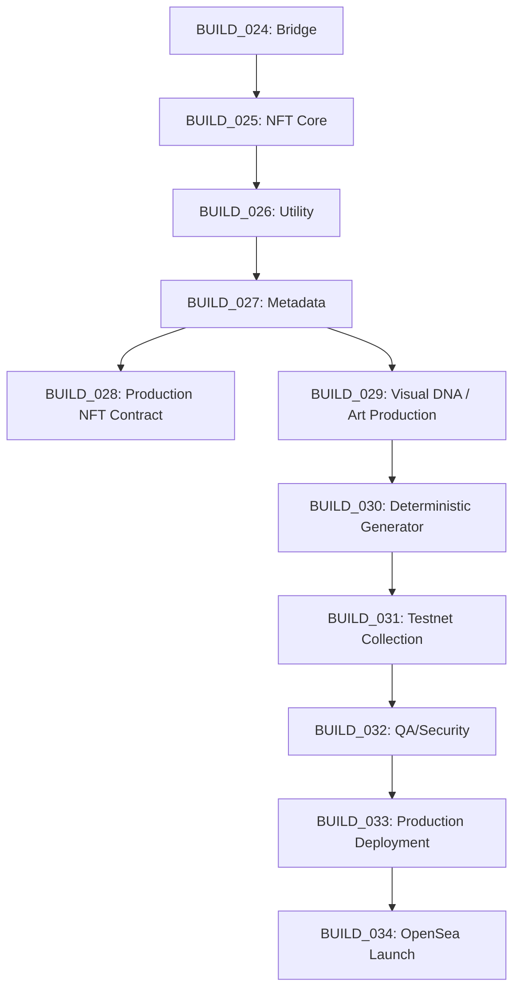

# TAPEBORN BUILD_027R
## METADATA ARCHITECTURE — CONSISTENCY REMEDIATION

**Status**: REMEDIATED SPECIFICATION — Documentation-only remediation of BUILD_027. No code changes. No implementation. No deployment.

**Purpose**: Ensure BUILD_027 is internally consistent and safe as architectural input for BUILD_028 (Production NFT Contract). All corrections are documentation-only.

**Based on**: BUILD_024R, BUILD_025, BUILD_026, BUILD_000 Forensic Audit, Existing Repository

**Classification Rule**: Every statement classified as:
- **VERIFIED IN CODE** — Directly observed in repository
- **VERIFIED IN TEST** — Confirmed by passing test suite
- **RECORDED DECISION** — Explicit project directive
- **PROPOSED** — Architecture proposal requiring owner approval
- **UNRESOLVED** — Requires founder decision; no proposal yet
- **SUPERSEDED / OUT OF SCOPE** — Explicitly deprecated

---

## A. METADATA RESPONSIBILITY BOUNDARY

### Four Layers — Separation of Concerns

| Layer | Responsibility | Mutability | Authority |
|-------|----------------|------------|-----------|
| **1. On-Chain NFT State** | `contract address`, `chainId`, `tokenId`, `owner`, `totalSupply`, `balanceOf`, `Transfer` events | Immutable after mint (except burn/transfer) | NFT Contract (Arc Mainnet) |
| **2. NFT Metadata** | `name`, `description`, `image`, `attributes`, `rarity`, `collection identity`, `external_url`, provenance references | **Immutable after finalization** | Content-addressed storage (CID) |
| **3. Artwork** | Visual asset (SVG/PNG/other) generated from signal provenance | **Immutable after finalization** | Content-addressed storage (CID) |
| **4. Intelligence** | `signalId`, `evidence`, `interpretation`, `historical data`, `derived intelligence`, `dynamic analytics` | **Mutable** (improves over time) | Intelligence DB (SQLite) |

**MANDATORY DECLARATION**:
> **Dynamic intelligence does NOT become part of immutable NFT metadata.**
> Intelligence layer remains a separate, evolving data product. NFT metadata captures a snapshot at mint/finalization time. Any future exception = **UNRESOLVED**.

---

## B. TOKEN METADATA JSON SCHEMA — PROPOSED PRODUCTION

### Conceptual Schema (OpenSea-compatible, ERC-721 Metadata Extension)

```json
{
  "name": "string",
  "description": "string",
  "image": "string (URI to artwork)",
  "external_url": "string (collection/homepage URL)",
  "attributes": [
    {
      "trait_type": "string",
      "value": "string|number",
      "display_type": "string|number|boost_percentage|boost_number|date" (optional)
    }
  ],
  "collection": {
    "name": "string",
    "family": "string" (optional)
  },
  "provenance": {
    "signalId": "string",
    "signalType": "string",
    "evidenceRoot": "string (CID or hash)",
    "generatorVersion": "string",
    "finalizedAt": "string (ISO timestamp)"
  }
}
```

### Field Requirements

| Field | Required | Type | Constraints | Classification |
|-------|----------|------|-------------|----------------|
| `name` | YES | string | Format: `<COLLECTION_NAME> #<TOKEN_ID>` | PROPOSED |
| `description` | YES | string | Human-readable, references signal provenance | PROPOSED |
| `image` | YES | string | Content-addressed URI (ipfs://, ar://, https://gateway) | PROPOSED |
| `external_url` | YES | string | Collection homepage or token detail page | PROPOSED |
| `attributes` | YES | array | Minimum: Rarity, Signal Type, Visual Traits | PROPOSED |
| `collection` | RECOMMENDED | object | OpenSea collection metadata | PROPOSED |
| `provenance` | PROPOSED | object | Links to intelligence layer | PROPOSED |

### Attribute Conventions

| Convention | Specification | Classification |
|------------|---------------|----------------|
| Trait naming | PascalCase (e.g., "Signal Type", "Rarity Tier") | PROPOSED |
| Value types | String for categorical, Number for quantitative | PROPOSED |
| Display types | `boost_percentage` for rarity %, `date` for timestamps | PROPOSED |
| Max attributes | 15 (OpenSoft practical limit) | PROPOSED |
| Reserved trait names | "Rarity", "Signal Type", "Mythic" | PROPOSED |

---

## C. TRAIT ARCHITECTURE

### Project Record — Existing Trait Information

**From BUILD_024/025 context and `artifacts/genesis_collection.json`**:

| Category | Source | Status |
|----------|--------|--------|
| Signal Type | 7 detectors (engine.js) | VERIFIED IN CODE |
| Confidence | Deterministic per type (0.5–0.9) | VERIFIED IN CODE |
| Signal Version | `v1.0.0` per signal-spec.yaml | VERIFIED IN CODE |
| Rarity Tier | 6 tiers (Common→Mythic) | RECORDED DECISION |

### Trait Matrix — UNRESOLVED

**No final visual trait matrix exists in repository.** The following are documented as **UNRESOLVED**:

| Trait Category | Visual Trait? | Utility Trait? | Status |
|----------------|---------------|----------------|--------|
| Signal Type → Shape | YES (proposed) | NO | UNRESOLVED |
| Confidence → Color | YES (proposed) | NO | UNRESOLVED |
| Block Number → Position | YES (proposed) | NO | UNRESOLVED |
| Tx Value → Size | YES (proposed) | NO | UNRESOLVED |
| Rarity Tier | YES (badge/border) | YES (holder tier) | UNRESOLVED |
| Mythic Status | YES (custom art) | YES (exclusive access) | UNRESOLVED |
| Generator DNA | NO | NO (internal) | UNRESOLVED |

**Critical**: Visual traits ≠ Utility traits. Visual traits drive artwork generation. Utility traits drive holder eligibility. They MAY overlap but are conceptually separate.

**No new trait list created** — all pending BUILD_029 (Visual DNA) and BUILD_030 (Generator).

---

## D. RARITY REPRESENTATION

### Recorded Rarity Tiers (VERIFIED ARITHMETIC: 1111+555+333+149+70+4 = 2222)

| Tier | Quantity | % of Supply | Classification |
|------|----------|-------------|----------------|
| Common | 1,111 | 50.0% | RECORDED DECISION |
| Uncommon | 555 | 25.0% | RECORDED DECISION |
| Rare | 333 | 15.0% | RECORDED DECISION |
| Epic | 149 | 6.7% | RECORDED DECISION |
| Legendary | 70 | 3.1% | RECORDED DECISION |
| Mythic | 4 (1/1 each) | 0.18% | RECORDED DECISION |

### Metadata Representation — PROPOSED

```json
{
  "trait_type": "Rarity",
  "value": "Common",
  "display_type": "boost_percentage",
  "max_value": 100
}
```

**Constraints**:
- Rarity metadata **consistent with final generator output** (BUILD_030)
- Rarity **immutable after finalization**
- Mythic = **1/1 each** (4 unique tokens)
- Rarity **NOT derived from live intelligence** — determined at mint/finalization

---

## E. TOKEN NAMING

### Relationship

| Component | Value | Classification |
|-----------|-------|----------------|
| Collection Name | **UNRESOLVED** (BUILD_025) | UNRESOLVED |
| Symbol | **UNRESOLVED** (BUILD_025) | UNRESOLVED |
| Token ID | Sequential 0–2221 | PROPOSED |
| Metadata Name | `<COLLECTION_NAME> #<TOKEN_ID>` | PROPOSED placeholder |

**No final name/symbol invented**. Placeholder used until owner decision.

---

## F. IMAGE / ARTWORK URI

### `metadata.image` Requirements

| Aspect | Specification | Classification |
|--------|---------------|----------------|
| Must point to | Final artwork asset | RECORDED DECISION |
| Format | **UNRESOLVED** — BUILD_029 dependency (SVG/PNG/both) | UNRESOLVED |
| URI scheme | Content-addressed (ipfs://, ar://) or HTTPS gateway | UNRESOLVED |
| Gateway fallback | Multiple gateways for availability | PROPOSED |
| Raw URI | Not recommended (mutability risk) | PROPOSED |

**Storage provider decision**: **UNRESOLVED** (IPFS / Arweave / Hybrid / On-chain)

---

## G. CONTENT IMMUTABILITY vs POINTER IMMUTABILITY — CORE PRINCIPLE

### The Distinction

| Concept | Definition | Achieved By |
|---------|------------|-------------|
| **Content Immutability** | The metadata JSON and artwork bytes cannot change without producing a new CID/hash | Content-addressed storage (IPFS, Arweave, on-chain calldata) |
| **Pointer Immutability** | The NFT contract's `tokenURI(tokenId)` cannot be changed to point to different metadata after finalization | **Contract logic** (not storage layer) |

### Critical Principle

> **IPFS/Arweave content addressing does NOT by itself make `tokenURI()` immutable.**
>
> If the contract retains `setBaseURI()` or per-token URI mapping, the pointer CAN be changed even if content is immutable. Contract behavior determines pointer mutability.

### Current Genesis State (VERIFIED IN CODE: `SignalArtifact.sol`)

```solidity
// MUTABLE - owner can change anytime
function setBaseURI(string memory _newURI) external onlyOwner { baseURI = _newURI; }
function setTokenURI(uint256 tokenId, string memory uri) { tokenURIs[tokenId] = uri; } // implied
```

### Production Requirement (RECORDED DECISION from BUILD_024)

> Production metadata must have explicit **pointer immutability mechanism** (finalization lock, removal of setter, governance-gated mutation).

---

## H. METADATA LIFECYCLE

### Conceptual Stages

```
┌─────────────┐
│   DRAFT     │  Internal generation, not persisted
└──────┬──────┘
       │ generate
       ▼
┌─────────────┐
│  GENERATED  │  Metadata JSON + artwork created, validated locally
└──────┬──────┘
       │ validate
       ▼
┌─────────────┐
│  VALIDATED  │  Schema, trait, rarity, artwork, consistency checks pass
└──────┬──────┘
       │ publish (pin to storage)
       ▼
┌─────────────┐
│  PUBLISHED  │  CID obtained, metadata available via gateway
└──────┬──────┘
       │ reveal (if pre-reveal model)
       ▼
┌─────────────┐
│  REVEALED   │  Final metadata accessible (pre-reveal placeholder replaced)
└──────┬──────┘
       │ finalize (lock pointer)
       ▼
┌─────────────┐
│  FINALIZED  │  Contract pointer locked; no further changes possible
└─────────────┘
```

### Transition Authority — PROPOSED

| Transition | Authority | Classification |
|------------|-----------|----------------|
| Draft → Generated | Generator (BUILD_030) | PROPOSED |
| Generated → Validated | Automated validation pipeline | PROPOSED |
| Validated → Published | Pinning service (CI/CD) | PROPOSED |
| Published → Revealed | **CONDITIONAL** — depends on reveal model | PROPOSED |
| Revealed → Finalized | **CONDITIONAL** — depends on finalization model | PROPOSED |

**Not Solidified** — no Solidity roles defined here.

---

## I. REVEAL MODEL — COMPARATIVE ANALYSIS

| Model | Description | Operational Complexity | UX | Contract Complexity | Metadata Risk | OpenSea Considerations | Provenance Implications |
|-------|-------------|------------------------|-----|---------------------|---------------|------------------------|-------------------------|
| **A: No Reveal** | Final metadata at mint | Low | Immediate | Low (single URI) | Low (no placeholder) | Simple; metadata ready day 1 | Provenance = mint tx |
| **B: Pre-Reveal Placeholder** | Placeholder → final via `setBaseURI` | Medium | Delayed reveal event | Medium (baseURI switch) | Medium (placeholder leakage) | Requires `refresh`; collection page shows placeholder until reveal | Provenance split: mint ≠ reveal |
| **C: Delayed Reveal** | Metadata generated after collection complete; single publish | High | Batch reveal | Low (if per-token URI) | Low (no placeholder) | Single refresh event; cleaner | Provenance = generation batch |

**Final selection**: **UNRESOLVED** — requires owner decision.

**Genesis precedent**: Used Model B (placeholder → reveal via `setBaseURI`) — VERIFIED IN CODE.

---

## J. METADATA FINALIZATION

### Post-Finalization Immutable Set

| Element | Must Be Immutable | Classification |
|---------|-------------------|----------------|
| Artwork URI | YES | RECORDED DECISION |
| Metadata URI | YES | RECORDED DECISION |
| Traits | YES | RECORDED DECISION |
| Rarity | YES | RECORDED DECISION |
| Token Identity (name, ID) | YES | RECORDED DECISION |
| Provenance references | YES | PROPOSED |

### Mutability Models — BOTH UNRESOLVED

| Model | Description | Attack Surface | Governance | Monitoring |
|-------|-------------|----------------|------------|------------|
| **Immutable Forever** | No contract function can change URI after finalize | None | None needed | Verify once |
| **Admin Mutable (Timelock)** | `setBaseURI`/`setTokenURI` gated by 24h Timelock | Delayed malicious change | 2-of-3 Multisig + 24h delay | Alert on proposal |
| **Governance Mutable** | DAO vote required | Slow but flexible | Token voting | Audit trail |

**No recommendation** — both **UNRESOLVED**. Owner must choose:
- **Immutable Forever** (simplest, highest trust)
- **Governed Mutable** (Timelock/DAO) if proven future upgrade need

**Timelock is NOT an authorization path for metadata mutation unless Governed Mutable model is selected.**

---

## K. BASE URI / TOKEN URI — ARCHITECTURE OPTIONS

| Option | Description | Gas/Storage | Flexibility | Immutability | Reveal | Marketplace Compat |
|--------|-------------|-------------|-------------|--------------|--------|-------------------|
| **1. Per-Token Immutable URI** | `tokenURI(tokenId)` returns full CID URI; no baseURI | Higher (32+ bytes/token) | Low (per-token) | Native (no setter) | N/A (always final) | ✅ Best |
| **2. Base URI + tokenId** | `tokenURI = baseURI + tokenId.json` | Lower (1 baseURI) | Medium (batch update) | Requires lock | `setBaseURI` reveal | ✅ Good |
| **3. Base URI Pre-Reveal → Locked** | Genesis model: placeholder baseURI → final baseURI locked | Low | Medium | Timelock lock | `setBaseURI` once | ✅ Good |
| **4. Custom Mapping** | `tokenURIs[tokenId]` mapping, fully custom | Highest | Highest | Complex | Any | ⚠️ Non-standard |

**Final choice**: **UNRESOLVED** — all four options remain on the table. Option 1 preferred for native immutability; Option 3 compatible with Genesis precedent.

---

## L. COLLECTION METADATA

### Required Fields (OpenSea / Marketplace Standard)

| Field | Purpose | Classification |
|-------|---------|----------------|
| `name` | Collection display name | PROPOSED |
| `description` | Collection description | PROPOSED |
| `image` | Collection banner/avatar | PROPOSED |
| `external_url` | Project homepage | PROPOSED |
| `royalty_info` | ERC-2981 pointer (if implemented) | UNRESOLVED |
| `creator` | Deployer/contract address | PROPOSED |

**No final artwork/banner created** — UNRESOLVED.

### `contractURI()` (EIP-173)

**Evaluation**:
- Purpose: Collection-level metadata for marketplaces
- Behavior: Returns URI to collection JSON
- Mutability: Same as token metadata (should be locked)
- Storage: Same provider as token metadata
- Marketplace: OpenSea reads `contractURI()` for collection page

**Status**: **UNRESOLVED** — whether to implement.

---

## M. OPENSEA COMPATIBILITY — METADATA EXPECTATIONS

### Minimum Requirements (Neutral Documentation)

| Requirement | Standard | Notes |
|-------------|----------|-------|
| `tokenURI(uint256)` | ERC-721 Metadata Extension | Returns valid JSON URI |
| JSON Schema | OpenSea Metadata Standards | `name`, `image`, `attributes`, `external_url` |
| `attributes` array | Trait-based filtering | `trait_type`, `value`, optional `display_type` |
| Collection identity | `contractURI()` or off-chain registry | Collection name, description, image |
| Transfer events | Standard ERC-721 `Transfer` | Indexed by OpenSea |
| Reveal/refresh | OpenSea "Refresh Metadata" button | Requires immutable CID or cache busting |

**No guarantee** that OpenSea honors royalties, displays correctly, or caches promptly — external platform behavior.

---

## N. PROVENANCE ARCHITECTURE — FOUR DOMAINS

| Domain | Components | Current Implementation | Production Requirement |
|--------|------------|------------------------|------------------------|
| **NFT Provenance** | Mint tx, `tokenId`, contract, owner/transfer history | VERIFIED IN CODE (Genesis) | Immutable; on-chain |
| **Artwork Provenance** | Art master, generator version, seed/DNA, generation timestamp, validation result | NOT IMPLEMENTED | Immutable; content-addressed |
| **Metadata Provenance** | Metadata version, generator version, content hash/CID, publication timestamp, finalization state | PARTIAL (schema v1.0.0 in genesis) | Immutable; content-addressed |
| **Intelligence Provenance** | `signalId`, evidence, interpretation/version | VERIFIED IN CODE (schema.js) | Mutable; off-chain DB |

**No private operational secrets in metadata** — RECORDED DECISION.

---

## O. GENERATOR COMPATIBILITY

### Conceptual Generator Output (for BUILD_030 consumption)

```json
{
  "tokenId": 1234,
  "artworkAsset": { "uri": "CONTENT_ADDRESS", "hash": "0x...", "format": "UNRESOLVED" },
  "traitSet": {
    "Signal Type": "large_transfer",
    "Rarity": "Legendary",
    "Visual Traits": { "shape": "...", "color": "..." }
  },
  "rarity": "Legendary",
  "dna": "UNRESOLVED",           // Format TBD in BUILD_030
  "seed": "UNRESOLVED",          // Policy TBD in BUILD_030
  "generationId": "UNRESOLVED",  // Batch/run identifier
  "metadataObject": { ... },     // Full metadata JSON per Section B
  "contentHashes": {
    "metadata": "0x...",
    "artwork": "0x..."
  }
}
```

**All generator internals**: **UNRESOLVED** — DNA format, seed policy, collision rules, validation criteria = BUILD_029/030.

---

## P. VALIDATION REQUIREMENTS — PRE-FINALIZATION GATES

| Gate | Validation | Classification |
|------|------------|----------------|
| **Schema Validation** | JSON valid against production schema (Section B) | PROPOSED |
| **Trait Validation** | All trait values from approved trait matrix (BUILD_029) | PROPOSED |
| **Rarity Validation** | Rarity matches recorded allocation (1111/555/333/149/70/4) | PROPOSED |
| **Token ID Validation** | Sequential 0–2221, no duplicates, no gaps | PROPOSED |
| **Artwork Validation** | Image exists at URI, resolves, correct format/dimensions | PROPOSED |
| **Metadata/Art Consistency** | Traits in metadata match visual traits in artwork | PROPOSED |
| **Collection Validation** | Collection metadata valid, 2222 total | PROPOSED |
| **Immutability Validation** | Final URI/CID/hash verifiable; contract pointer locked | PROPOSED |
| **Supply Validation** | Final collection = exactly 2222 | RECORDED DECISION |

**No test implementation** — specification only.

---

## Q. HASH / CONTENT IDENTIFIERS

| Identifier | Role | On-Chain? | Classification |
|------------|------|-----------|----------------|
| **CID (IPFS/Arweave)** | Primary content address for metadata + artwork | NO (URI only) | UNRESOLVED |
| **Metadata Hash** | `keccak256(metadataJSON)` for integrity verification | PROPOSED (optional) | UNRESOLVED |
| **Artwork Hash** | `keccak256(artworkBytes)` for integrity verification | PROPOSED (optional) | UNRESOLVED |
| **Generator DNA Hash** | Links metadata to specific generator run | NO | UNRESOLVED |

### Comparison

| Strategy | Pros | Cons |
|----------|------|------|
| URI only | Simple, standard | No on-chain verification |
| URI + off-chain hash | Verifiable off-chain | Requires trusted indexer |
| URI + on-chain hash | Fully verifiable on-chain | Gas cost (32 bytes × 2222) |

**Final**: **UNRESOLVED** — depends on storage + contract architecture.

---

## R. STORAGE ARCHITECTURE — COMPARISON

| Criterion | IPFS | Arweave | Hybrid (IPFS + Arweave) | On-Chain (calldata) |
|-----------|------|---------|-------------------------|---------------------|
| **Permanence** | Requires pinning | Permanent by design | Best of both | Permanent |
| **Content Addressing** | CIDv1 (sha2-256) | TX ID + tags | Both | keccak256 |
| **Availability** | Gateway-dependent | Gateway-dependent | Redundant gateways | Full node |
| **Gateway Dependency** | High | Medium | Medium | None |
| **Operational Complexity** | Pinning service, pin monitoring | Wallet funding, bundling | Double ops | High gas |
| **Pinning Requirements** | Active (pinning service) | None (miners store) | IPFS pinning + Arweave | None |
| **Recovery** | Re-pin from backup | Re-broadcast TX | Cross-recovery | N/A |
| **Cost (2222 tokens)** | Low (pinning service ~$20/mo) | Medium (~$0.01/token) | Medium-High | Very High (~$50k+) |

**No final decision** — **UNRESOLVED**. Owner must weigh cost vs permanence vs operational burden.

**Hybrid is NOT "PROPOSED for production"** — it is evaluated as an option. No storage provider is approved.

---

## S. BACKUP / REDUNDANCY

### Required Components

| Component | Purpose | Status |
|-----------|---------|--------|
| Primary Storage | Main CID resolution | UNRESOLVED |
| Backup Storage | Secondary provider (e.g., IPFS + Arweave) | PROPOSED |
| Gateway Redundancy | Multiple public gateways (cf-ipfs, ipfs.io, pinata, etc.) | PROPOSED |
| Manifest Backup | JSON manifest of all 2222 CIDs + hashes | PROPOSED |
| CID Inventory | Searchable index of tokenId → CID mapping | PROPOSED |
| Validation Manifest | Post-pin verification results | PROPOSED |

**No backup currently exists** — all PROPOSED / UNRESOLVED.

---

## T. FAILURE MODES

| Failure | Consequence | Prevention | Detection | Recovery |
|---------|-------------|------------|-----------|----------|
| Missing image | Broken display | Pre-pin validation; multiple gateways | Automated health check | Re-pin from backup |
| Invalid JSON | Metadata unreadable | Schema validation gate | CI/CD validation | Regenerate from source |
| Wrong CID | Wrong artwork/metadata | Double-check manifest | Hash verification | Replace URI (if mutable) |
| Incorrect trait | Wrong rarity display | Trait matrix validation | Automated diff | Regenerate |
| Incorrect rarity | Marketplace misrepresentation | Supply validation gate | Audit | Regenerate |
| Duplicate token metadata | Two tokens same metadata | Uniqueness validation | Index check | Regenerate |
| Broken gateway | Metadata unavailable | Multi-gateway, local gateway | Monitoring | Failover gateway |
| Unavailable storage provider | Permanent loss (if single) | Hybrid storage, backup | Health checks | Restore from backup |
| Accidental overwrite | Corrupted metadata | Immutable storage; no overwrite API | Versioning | Restore from CID |
| Premature finalization | Placeholder locked as final | Multi-sig finalize gate | Timelock delay | N/A (immutable) |
| Incorrect base URI | All tokens point wrong | Pre-flight simulation | Dry-run deployment | Timelock cancel |
| Metadata pointer mutation | Trust loss | Pointer lock mechanism | Event monitoring | N/A (if locked) |
| OpenSea stale cache | Wrong display for users | Immutable CID; manual refresh | User reports | OpenSea refresh |

---

## U. SECURITY MODEL — METADATA-SPECIFIC

| Threat | Technical Mitigation | Governance Mitigation |
|--------|---------------------|----------------------|
| Metadata substitution | Content-addressed storage; hash verification | Multi-sig finalize |
| URI hijacking | HTTPS/TLS; gateway pinning; SRI for frontend | Domain monitoring |
| Mutable base URI abuse | Remove `setBaseURI` post-finalize; **CONDITIONAL** Timelock | **CONDITIONAL** Timelock delay + alert |
| Admin key compromise | Hardware wallet; multi-sig; Timelock | Key rotation policy |
| Unauthorized finalization | **CONDITIONAL** Timelock + 2-of-3 proposer | Finalize ceremony |
| Wrong metadata-to-token mapping | Automated generation; manifest verification | Audit before finalize |
| Trait manipulation | Trait matrix locked pre-generation | Generator audit |
| Rarity manipulation | Supply validation gate (2222 exact) | Public verification |
| Generator compromise | Deterministic, audited generator; reproducible builds | Open-source generator |
| Storage compromise | Hybrid storage; geographic redundancy | Backup verification |
| Backup inconsistency | Automated consistency checks | Periodic audit |

---

## V. DATA BOUNDARY WITH INTELLIGENCE

| Data | On-Chain | Metadata | Intelligence DB/API |
|------|----------|----------|---------------------|
| `tokenId` | ✓ | ✓ (derived) | index |
| `owner` | ✓ | no | cache/index |
| `artwork` | no | ✓ | no |
| `traits` | no | ✓ | optional index |
| `rarity` | no | ✓ | optional index |
| `signalId` | no | ✓ (provenance ref) | ✓ |
| `evidence` | no | no (ref only) | ✓ |
| `interpretation` | no | no (ref only) | ✓ |
| `historical intelligence` | no | no | ✓ |
| `dynamic intelligence` | no | no | ✓ |

**Aligned with BUILD_024R, BUILD_026** — Intelligence stays off-chain; metadata holds only provenance reference.

---

## W. CANONICAL METADATA DECISION REGISTER

**BUILD_027 canonicalizes metadata-specific decisions inherited from BUILD_025.** Historical decisions in BUILD_025 are not erased; this register is the authoritative source for metadata architecture.

| Decision | Status | Current Position | Owner Approval Required |
|----------|--------|------------------|-------------------------|
| Storage provider | UNRESOLVED | IPFS / Arweave / Hybrid evaluated | YES |
| Reveal model | UNRESOLVED | No Reveal / Placeholder / Delayed | YES |
| Metadata finalization | UNRESOLVED | Immutable vs governed mutable | YES |
| Pointer immutability | UNRESOLVED | Depends on finalization model | YES |
| URI architecture | UNRESOLVED | Per-token / Base URI / Locked Base URI / Custom | YES |
| `contractURI` | UNRESOLVED | Evaluate requirement | YES |
| Hash strategy | UNRESOLVED | CID / off-chain hash / on-chain hash | YES |
| Backup strategy | UNRESOLVED | To be defined | YES |
| Collection metadata | UNRESOLVED | Schema to be finalized | YES |
| `external_url` | UNRESOLVED | Canonical website destination TBD | YES |
| Trait matrix | UNRESOLVED | BUILD_029 dependency | YES |
| Generator DNA | UNRESOLVED | BUILD_030 dependency | YES |
| Metadata versioning | UNRESOLVED | To be defined | YES |
| Artwork format | UNRESOLVED | BUILD_029 dependency | YES |

---

## X. ROADMAP DEPENDENCY



---

## Y. CONTRACT DEPENDENCY MATRIX

**This matrix prevents BUILD_028 from treating unresolved options as implementation requirements.**

| Contract Capability | Required Now? | Depends On |
|---------------------|---------------|------------|
| `tokenURI(uint256)` | YES | URI architecture decision |
| `baseURI` | CONDITIONAL | URI architecture (Option 2/3) |
| Per-token URI mapping | CONDITIONAL | URI architecture (Option 1/4) |
| Reveal mechanism (`setBaseURI` or equivalent) | CONDITIONAL | Reveal model (Model B) |
| Finalization lock (remove setter / lock flag) | CONDITIONAL | Finalization model (Immutable Forever) |
| Metadata mutation (`setBaseURI`/`setTokenURI` post-finalize) | CONDITIONAL | Governed Mutable model selected |
| `contractURI()` | CONDITIONAL | Collection metadata decision |
| Timelock metadata authority | CONDITIONAL | Governed Mutable model selected |
| Metadata events (mint, finalize, reveal) | CONDITIONAL | Finalization/reveal model |

---

## Z. GENERATOR DEPENDENCY MATRIX

| Generator Output | Status |
|------------------|--------|
| Artwork asset | REQUIRED |
| Trait set | REQUIRED |
| Rarity | REQUIRED |
| Metadata JSON | REQUIRED |
| Content identifier (CID/hash) | REQUIRED after storage decision |
| DNA/seed | REQUIRED after BUILD_029 decision |
| Validation report | REQUIRED |
| Final URI | DEPENDS ON STORAGE + URI ARCHITECTURE |

---

## AA. FINALIZATION SECURITY INVARIANT

**The system must ensure that the finalization mechanism cannot accidentally create a state where:**

- Token points to wrong metadata
- Metadata is finalized before validation
- Final URI can be silently replaced
- Governance path bypasses intended immutability
- Reveal state and final state disagree

**This is an architectural invariant** — not an implementation. BUILD_028 must satisfy this invariant regardless of which finalization model is chosen.

---

## AB. EXPLICIT NON-GOALS

**BUILD_027R does NOT**:
- ❌ Write Solidity
- ❌ Modify Genesis contract
- ❌ Generate art
- ❌ Generate 10/100/2222 NFTs
- ❌ Pin metadata
- ❌ Upload artwork
- ❌ Deploy
- ❌ Modify OpenSea
- ❌ Implement utility
- ❌ Implement authentication
- ❌ Select storage provider
- ❌ Select reveal model
- ❌ Select finalization model
- ❌ Select URI architecture

---

## AC. FINAL VALIDATION

| Check | Result |
|-------|--------|
| 1. Rarity arithmetic = 2222 | ✅ 1111+555+333+149+70+4 = 2222 |
| 2. No final collection name invented | ✅ Placeholder only |
| 3. No final symbol invented | ✅ Placeholder only |
| 4. No storage provider silently selected | ✅ All UNRESOLVED |
| 5. No mint price | ✅ None |
| 6. No royalty percentage | ✅ None |
| 7. No whitelist architecture | ✅ SUPERSEDED only |
| 8. No "IPFS = pointer immutable" claim | ✅ Explicitly separated (Section G) |
| 9. No "production metadata exists" claim | ✅ All PROPOSED/UNRESOLVED |
| 10. No actual artwork generated | ✅ None |
| 11. No production code changed | ✅ Only docs/BUILD_027...md |
| 12. Dynamic intelligence outside NFT metadata | ✅ Section A declaration |
| 13. SignalId ↔ NFT unresolved | ✅ Section I, V, W |
| 14. Canonical decision register created | ✅ Section W (14 decisions) |
| 15. No duplicate metadata decisions | ✅ Deduplicated with BUILD_025 reference |
| 16. Artwork format UNRESOLVED + BUILD_029 dependency | ✅ Section F, O |
| 17. No "MUST" claims assuming unresolved architecture | ✅ Contract dependencies conditional |
| 18. No "Timelock implies metadata mutability" | ✅ Timelock conditional on Governed Mutable |
| 19. No "PRODUCTION" claims implying storage selected | ✅ Storage UNRESOLVED |
| 20. Content vs pointer immutability separated | ✅ Section G |
| 21. Only BUILD_027 documentation modified | ✅ Confirmed |

---

## REQUIRED FINAL REPORT

### BUILD_027R STATUS
**PASS** — All consistency issues remediated. Document is safe as architectural input for BUILD_028.

### FILE MODIFIED
- `docs/BUILD_027_METADATA_ARCHITECTURE.md` (fully rewritten)

### CHANGES
1. **Contract Dependencies** → Replaced with **Contract Dependency Matrix** (Section Y) — all capabilities conditional on owner decisions
2. **Timelock** → Made explicitly conditional on "Governed Mutable" finalization model; not an authorization path for Immutable Forever
3. **Storage** → Removed "PROPOSED for production" language; all providers UNRESOLVED
4. **Canonical Decision Register** → Created Section W as single authoritative table (14 decisions)
5. **Deduplication** → Added explicit statement: "BUILD_027 canonicalizes metadata-specific decisions inherited from BUILD_025"
6. **Artwork Format** → Classified as "BUILD_029 dependency" in Sections F and O
7. **Generator Dependency Matrix** → Added Section Z
8. **Finalization Security Invariant** → Added Section AA
9. **Validation** → All 21 checks pass; no "MUST" claims assume unresolved architecture

### CANONICAL UNRESOLVED DECISIONS
**14 metadata-specific decisions** (from Section W):
1. Storage provider
2. Reveal model
3. Metadata finalization mechanism
4. Pointer immutability
5. URI architecture
6. `contractURI()` implementation
7. Hash strategy
8. Backup strategy
9. Collection metadata structure
10. `external_url` format
11. Final trait matrix
12. Generator DNA representation
13. Metadata versioning policy
14. Artwork format

**Total unresolved (including inherited)**: 42 (14 metadata + 28 from BUILD_025/026)

### CONTRACT DEPENDENCY CHANGES
- `tokenURI`: Always required
- `baseURI`, per-token mapping, reveal mechanism, finalization lock, metadata mutation, `contractURI`, Timelock authority, metadata events: **All CONDITIONAL** on owner decisions
- BUILD_028 must implement ONLY what the selected architecture requires

### STORAGE STATUS
**UNRESOLVED — no storage provider approved.** IPFS / Arweave / Hybrid / On-chain all evaluated; none selected.

### FINALIZATION STATUS
**UNRESOLVED — immutable vs governed mutable not approved.** Both models on the table; Timelock only relevant if Governed Mutable selected.

### CODE CHANGES
**NONE** — Documentation-only remediation.

### NEXT BUILD
**BUILD_028 — PRODUCTION NFT CONTRACT**

> **Do NOT execute BUILD_028.** Requires owner review of BUILD_027R and resolution of UNRESOLVED decisions (especially storage, reveal, finalization, URI architecture).

---

*End of BUILD_027R Metadata Architecture Consistency Remediation*
*Last updated: 2026-09-23*
*Classification: VERIFIED IN CODE / VERIFIED IN TEST / RECORDED DECISION / PROPOSED / UNRESOLVED / SUPERSEDED — no assumptions presented as decisions*