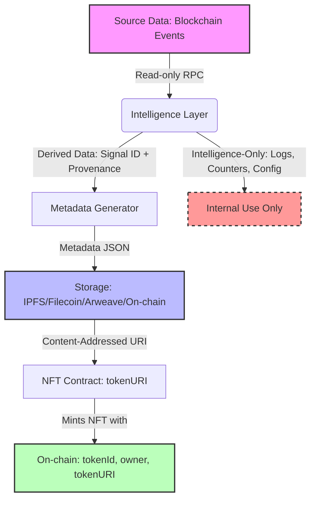

# NFT Data Boundaries

## Definitions

This document classifies where different types of data reside in the TapeBorn system and what access patterns are permitted. It clarifies the separation between on‑chain data, metadata, external storage, and intelligence‑layer‑only data.

## Data Categories

| Category | Location | Mutability | Access Method | Examples | Notes |
|----------|----------|------------|---------------|----------|-------|
| **Source Data (On‑chain)** | Blockchain (Arc Mainnet/Testnet) | Immutable | RPC / indexer (read‑only) | Transaction hash, block number, log data, contract state | Fundamental truth layer; never modified by TapeBorn |
| **Derived Data (On‑chain)** | Blockchain (via NFT contract storage) | Immutable after mint | Contract reads (view functions) | `tokenId`, `owner`, `tokenURI`, mint timestamp, burn flag | Written only by the NFT contract during mint/burn; governed by access control |
| **Metadata** | Off‑chain (IPFS, Filecoin, Arweave, or on‑chain via URI) | Immutable after storage fixed | HTTP/IPFS gateway, or contract `tokenURI` | JSON following metadata schema (name, description, image, attributes, provenance_ref) | Must be content‑addressed (CID) or immutable URL to guarantee permanence |
| **Artifact** | Off‑chain (IPFS/Filecoin/Arweave) or bundled with metadata | Immutable after storage fixed | Same as metadata | SVG trace, PNG render, audio file, 3D model | Represents the visual/trace output of the signal; must be permanently linked |
| **Intelligence‑Layer‑Only Data** | Persistence layer (SQLite), cache, logs | Mutable (subject to retention policy) | Internal API (intelligence layer) | Signal engine output, confidence components, detection parameters, internal counters, temporary state | Not exposed externally except via derived data; used for signal generation, filtering, analytics |
| **Configuration** | Repository (config files, environment) | Mutable via GitHub | Git, CI/CD, admin scripts | RPC URLs, chain IDs, contract addresses, feature flags | Not on‑chain; changing requires redeploy or contract upgrade (if applicable) |

## Data Flow & Boundaries

## Access Rules

1. **On‑chain data** may only be read by contracts and external observers; TapeBorn never writes to source data (it only observes).
2. **Derived data** written by the NFT contract is immutable after the transaction is confirmed (subject only to contract‑defined functions like `burn` if supported).
3. **Metadata and Artifact** must be made immutable before the NFT’s `tokenURI` is set. Best practice is to store them on a content‑addressed network (IPFS/Filecoin/Arweave) and use the CID as the URI.
4. **Intelligence‑layer‑only data** must never be exposed as part of the NFT’s provenance unless explicitly summarized and placed in metadata (e.g., “confidence: 0.87”). Raw internal counters, detection parameters, and temporary state are not part of the artifact’s provenance.
5. **Configuration** (RPCs, addresses) is external to the data flow and may change between deployments (testnet → mainnet) but does not affect the immutability of already‑minted NFTs.

## Open Questions (Founder Decisions)

- Where should metadata and artifact be stored long‑term? (IPFS/Filecoin/Arweave/on‑chain)
- What is the immutability guarantee for metadata? (Must be permanent; IPFS/Filecoin/Arweave provide this; on‑chain storage is costly but immutable)
- Should the intelligence layer retain derived data indefinitely, or is there a retention policy?
- How should provenance be referenced in metadata? (Direct embedding vs. reference to an intelligence‑layer API)
- Are there privacy considerations for intelligence‑layer‑only data (e.g., wallet clustering) that must be excluded from metadata?

---
*Status: PROPOSED (awaiting founder decisions)*
*Last updated: 2026-09-23*